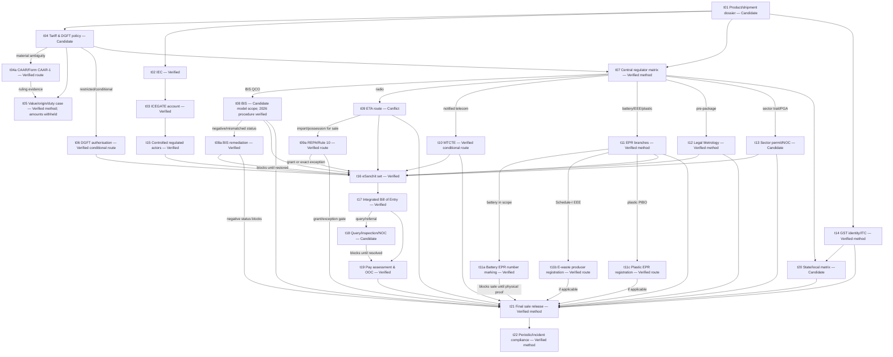

# Journey 1 — Import and legally sell the first regulated product shipment into India

Verified on **2026-08-28 (Asia/Kolkata)**. Overall readiness: **Action Required**.

This dossier is the human-readable view of [`01-import-regulated-product.json`](./01-import-regulated-product.json). The JSON is the normalized ingestion artifact and contains the full field-level portal, input, proof, tracking, rejection, escalation and source metadata.

## Outcome and boundary

The graph covers the Indian importer of record from product fact collection through IEC, tariff/import-policy analysis, conditional national product regulation, environmental/EPR and packaged-commodity controls, GST, regulated/private logistics, electronic customs filing, PGA review, assessed payment, Customs Out of Charge, State/local dependency resolution and final sale release.

It does **not** supply a universal tariff code, duty/GST rate, exemption, trade-remedy result, approval, fee, deadline or State procedure. A `Free` DGFT policy entry and Customs Out of Charge do not displace applicable domestic product, environmental, tax, labelling or State/local law. Unknowns remain visible blockers.

Research reused the prior BWMI electronics graph only as a source-discovery and fail-closed modelling checklist. Every operative claim below was reopened against the competent official source on 2026-08-28; no old code mapping, status or duty conclusion was transplanted.

## Decision rule

- `Verified` means the task instruction is driven only by directly supported current primary claims. It does not mean the user has completed the task.
- `Candidate` means shipment/product facts, exact scope or current route evidence are still missing.
- `Conflict` means official sources disagree or an older route remains exposed beside a newer transition notice.
- Only the task IDs explicitly listed as the demo's verified common path are happy-path actions. The classification, BIS, WPC and location gates remain Action Required and block dispatch or sale.

## Qualifying questions

| ID | Question | Blocking consequence |
|---|---|---|
| `q.product-identity` | Exact product/model, construction, principal function, materials, intended use and retail presentation? | No final classification, regulatory scope, duty, artwork, dispatch or sale without a model dossier. |
| `q.condition` | New finished, part/component, sample, used/refurbished, waste/scrap or repair/re-export? | Non-ordinary or unknown status blocks the ordinary commercial-sale path. |
| `q.radio` | Every radio band, power, modulation, module and antenna? | Missing RF facts/current de-licensed-band evidence blocks import and sale. |
| `q.telecom` | Notified telecom equipment or consumer accessory? | An uncertain answer requires a current MTCTE product/ER check. |
| `q.sector` | Food, health, plant, animal, wildlife, chemical, pesticide, hazardous, ODS, fuel/pressure/explosive, energy-labelled or other regulated trait? | Any positive or uncertain trait requires its exact regulator, pre-import permit, port and NOC path. |
| `q.battery-waste-packaging` | Battery, EEE, plastic packaging or another EPR stream? | Unknown scope, missing producer registration or missing battery registration-number marking proof blocks sale. |
| `q.retail-package` | Pre-packaged before buyer presence; what declarations/channels? | Unresolved Legal Metrology scope or artwork quarantines stock. |
| `q.importer-identity` | Actual Indian importer; matching PAN, bank, IEC, GSTIN, address and signatory? | No assumed/borrowed identity or filing credential. |
| `q.shipment` | Origin, supplier/factory, value elements, Incoterm, currency, route and port? | No final value, origin, remedy, preference, port or filing conclusion. |
| `q.import-policy` | Supported current code and Free/Restricted/Prohibited/STE/port condition? | Uncertain or conditional policy blocks dispatch. |
| `q.tax-sale-model` | State/UT, premises, storage, intra/inter-State and retail/e-commerce model? | No universal GST or local-permission conclusion. |
| `q.approval-scope` | Does holder/AIR, factory, brand, model, standard, validity and conditions match? | Any mismatch, suspension or unverifiable record blocks dispatch and sale. |

## Central task graph

The JSON has 55 explicit dependency edges across 28 tasks, including every conditional branch and sale blocker.

## Task register

| Task | Status | Trigger and verified action | Completion proof | Tracking, rejection and escalation | Claims |
|---|---|---|---|---|---|
| `imp.t01` Product/shipment dossier | Candidate | Before PO/testing/dispatch: record exact model, technical traits, condition, package, parties, values, route and every unknown. | `proof.dossier` | Version by model/shipment; reject generic or inconsistent supplier evidence; escalate missing facts to manufacturer/classification specialist. | `clm.domestic-laws`, `clm.classification-demo` |
| `imp.t02` IEC | Verified | Apply/update electronically on DGFT using matching entity, PAN, contact, constitution and bank facts; download and independently verify e-IEC. | `proof.iec` | DGFT reference and View your IEC; correct source-system mismatches; use DGFT grievance/help. | `clm.iec-required`, `clm.iec-route`, `clm.iec-proof` |
| `imp.t03` ICEGATE account | Verified | Register the correct role, match DGFT/GSTN identity, complete current authentication and verify IEC-GSTIN mapping if used. | `proof.icegate-account` | Logged-in dashboard/reference; fix authoritative records; ICEGATE Helpdesk, with Customs Service Centre only as access fallback. | `clm.icegate-registration`, `clm.customs-service-centre` |
| `imp.t04` Classification/policy | Candidate | Apply tariff text/notes to objective facts; check current DGFT policy/conditions; use CIP only as an aid; escalate material ambiguity to specialist/binding route. | `proof.classification-record` | Version tariff edition, facts and alternatives; preserve customs disagreement and lawful review route. | `clm.customs-self-assessment`, `clm.customs-cip`, `clm.classification-demo` |
| `imp.t04a` Customs advance ruling | Verified conditional | When material ambiguity remains, identify regulation-6 jurisdiction, submit Form CAAR-1 with complete product/transaction/legal evidence, and wait for the signed in-scope ruling where the ambiguity is a dispatch blocker. | `proof.customs-advance-ruling` | Track acknowledgement, requisitions, hearing and ruling; non-admission or a different-facts ruling is not proof. | `clm.caar-route` |
| `imp.t05` Value/origin/duty case | Verified method | Document transaction additions, related-party facts, origin/preference and current exemptions/remedies; create line calculation with unsupported numbers blank. | `proof.duty-workpaper` | Reconcile to assessment; respond with transaction/origin evidence; specialist review for related party, royalty, origin or remedy uncertainty. | `clm.customs-value`, `clm.import-igst`, `clm.customs-cip` |
| `imp.t06` Restricted import authorisation | Verified conditional | If required, use DGFT Import Management System with exact code, specification, quantity/UOM, CIF, country, port, purpose and justification; wait for grant. | `proof.dgft-authorisation` | Track application and utilisation; pending/rejected is not permission; prohibited goods remain blocked. | `clm.restricted-route`, `clm.domestic-laws` |
| `imp.t07` Central regulator matrix | Verified method | Map each trait to current BIS, WPC, TEC, EPR, LM and sector notification; record applicable/non-applicable conclusion and exact proof separately. | `proof.regulator-matrix` | Date each row; reopen on new trait/scope mismatch; seek competent-authority clarification for ambiguity. | `clm.domestic-laws`, `clm.bis-qco`, `clm.sector-branches`, `clm.environment-scope` |
| `imp.t08` BIS | Candidate model scope | Determine exact QCO/scheme/standard; under substituted Scheme II use Form I, Form II, third-party lab report, applicable Form III and Form IV for a foreign manufacturer; only Form V proves grant. | `proof.bis-coverage` | Search public status by registration/product/model/status/validity/brand; use published CRS support/grievance channels. | `clm.bis-qco`, `clm.crs-headphones`, `clm.crs-route`, `clm.bis-scheme2-fees`, `clm.bis-scheme2-validity`, `clm.bis-public-check`, `clm.bis-negative-status` |
| `imp.t08a` BIS negative-status remedy | Verified conditional | On notice, suspension, cancellation, expiry or scope mismatch, stop affected import/sale, answer within the official process and release only after current BIS evidence restores exact scope. | `proof.bis-remediation` | At least 21 days' Scheme-II notice; after cancellation stop Standard Mark use and supply/import/distribution/sale; support ticket/grievance does not reinstate scope. | `clm.bis-negative-status`, `clm.bis-public-check` |
| `imp.t09` WPC/DoT ETA | Conflict | Map exact RF configuration and determine ETA plus every independent radio authorisation; obtain written confirmation of the post-transition ETA route. | `proof.wpc-coverage` | The conflict is now confined to ETA's legacy Saral instruction; REPA has a separate verified route. | `clm.wpc-eta-scope`, `clm.wpc-route-conflict`, `clm.repa-route-exceptions` |
| `imp.t09a` REPA / rule 10 | Verified conditional | For import/possession of radio equipment for sale/hire/test/demo, match rules 4 and 10; obtain the REPA grant unless an exact exception permits the intended activity. | `proof.repa-coverage` | Track Authorisation Portal status, LoI/payment and grant; the end-user exception cannot be used to manufacture, sell or hire equipment. | `clm.repa-route-exceptions`, `clm.repa-fees`, `clm.repa-validity` |
| `imp.t10` MTCTE | Verified conditional | Check current notified products/ERs; eligible Indian applicant/AIR tests/applies; verify model/OEM/AIR/validity/conditions. | `proof.mtcte-coverage` | Monitor portal/certificate changes; TEC clarification when consumer accessory scope is unclear. | `clm.mtcte-scope` |
| `imp.t11` EPR branches | Verified method | Separately map battery, Schedule-I EEE, plastic packaging and other streams; route positive branches to `imp.t11a`, `imp.t11b` and `imp.t11c`. | `proof.epr-coverage` | Track registrations/targets/returns separately; a generic portal account or recycler contract is insufficient. | `clm.ewaste-scope`, `clm.ewaste-registration-route`, `clm.battery-scope`, `clm.plastic-epr-registration`, `clm.plastic-migration`, `clm.environment-scope` |
| `imp.t11a` Battery EPR number marking | Verified | After producer registration, mark the battery/battery pack with the EPR number; if using the 2025 alternative, first provide information in writing to CPCB and place the number through an allowed QR/barcode or brochure method. Inspect the actual lot before sale. | `proof.battery-epr-marking` | Track registration number, chosen method, CPCB notice, artwork, SKU/lot and scan result; quarantine unmarked, wrong-number or unreadable stock. | `clm.battery-registration-marking`, `clm.battery-marking-method-2025` |
| `imp.t11b` E-waste producer registration | Verified conditional | Once exact Schedule-I mapping is supported, apply through CPCB's E-Waste EPR Portal and match the granted producer/category/status evidence before market placement. | `proof.ewaste-registration` | Exact headphone mapping and authenticated case remain unresolved; ask CPCB on category/portal objection. | `clm.ewaste-scope`, `clm.ewaste-registration-route` |
| `imp.t11c` Plastic-packaging PIBO | Verified conditional | Complete packaging BOM/PIBO role/category, register through Common EPR after the 28-06-2026 migration, and control quantities, targets, certificates and returns. | `proof.plastic-epr-registration` | Packaging vendor/recycler evidence is not the importer's registration; logged-in fields/fees remain case evidence. | `clm.plastic-epr-registration`, `clm.plastic-migration` |
| `imp.t12` Legal Metrology | Verified method | Confirm coverage/jurisdiction; follow the current Department instruction to apply for Rule 27 registration through NSWS; validate the certificate, physical package and online declarations. | `proof.lm-coverage`, `proof.label-release` | Track NSWS reference and public certificate registry; use `dirwm-ca@nic.in`; Central-versus-State jurisdiction remains case-specific. | `clm.lm-packages`, `clm.lm-route-proof` |
| `imp.t13` Other sector/PGA | Candidate | Identify exact statute, regulator, pre-import permit and designated port; obtain permit before dispatch; use current SWIFT referral/inspection/NOC route. | `proof.sector-authorisation`, `proof.pga-noc` | Track permit and shipment NOC separately; no unapproved-port diversion; confirm phased PQ route. | `clm.sector-branches`, `clm.swift-current`, `clm.pqms-phased` |
| `imp.t14` GST | Verified method | Determine liability and State/UT; a liable person applies within section 25 timing. Configure section-31/rule-46 taxable-goods invoices and claim import credit only with statutory evidence. | `proof.gst-registration`, `proof.gst-invoice-config`, `proof.import-tax-record` | Track ARN/notices/certificate and reconcile BOE/books/returns; actual liability, rate and return profile remain case-specific. | `clm.gst-route`, `clm.gst-registration-timing`, `clm.gst-invoice`, `clm.import-itc` |
| `imp.t15` Regulated/private actors | Verified | Verify broker/carrier/custodian/bank/lab authority and scope; issue controlled mandates; book only after dispatch gates close. | `proof.actor-mandates` | Maintain licence/accreditation/authority/exception file; broker acceptance is not permission. | `clm.esanchit-docs`, `clm.customs-electronic-be` |
| `imp.t16` eSanchit set | Verified | Reconcile invoice, packing and transport data; upload transport document, commercial invoice, packing list and every conditional permit/certificate; map references to lines. | `proof.esanchit-set` | Track document references/version; correct through controlled upload; Helpdesk/Service Centre for verified access failure. | `clm.esanchit-docs`, `clm.customs-service-centre` |
| `imp.t17` Integrated BOE | Verified | Review and submit; preserve positive/negative acknowledgement and processed BE; capture BOE number/date and monitor Job Status. | `proof.bill-of-entry` | A negative acknowledgement is not filing: correct and resubmit. Use 24x7 ICEGATE Helpdesk with message/BE evidence. | `clm.customs-electronic-be`, `clm.customs-self-assessment`, `clm.swift-current`, `clm.be-tracking`, `clm.icegate-negative-remediation` |
| `imp.t18` Query/inspection/NOC | Candidate | Preserve exact query; use the current query-reply message/service; arrange authorised examination/sampling and track customs/PGA decisions separately. | `proof.pga-noc`, `proof.assessment-clear` | SWIFT/job status and timestamped replies; quarantine noncompliance; authority-directed remediation/re-export/destruction/appeal only. | `clm.customs-verification`, `clm.be-tracking`, `clm.icegate-negative-remediation`, `clm.swift-current`, `clm.pqms-phased` |
| `imp.t19` Payment and OOC | Verified | Pay only the live assessment/challan through the current ICEGATE service; retain acknowledgement; wait for formal OOC; reconcile custodian release. | `proof.customs-payment`, `proof.out-of-charge` | Track payment/OOC statuses; reconcile failed/duplicate payment with ICEGATE/bank; no payment to unverified demand. | `clm.customs-release`, `clm.be-tracking`, `clm.import-igst` |
| `imp.t20` State/local matrix | Candidate | Once State, municipality, premises and activity are known, verify applicable trade/shop/fire/professional-tax/pollution/LM/sector/excise permissions with competent authority. | `proof.state-local-matrix` | Location-by-location register; no copied State conclusion; unresolved applicable permission blocks the premises/sale. | `clm.state-local`, `clm.sector-branches`, `clm.gst-route`, `clm.lm-packages` |
| `imp.t21` Final sale release | Verified method | Match the lot to BOE and every applicable BIS/ETA/REPA/MTCTE/EPR/LM/GST/local proof, including physical battery marking and the configured tax invoice; inspect package/listing and sign release. | `proof.sale-release`, `proof.gst-invoice-config` | Any negative regulator status, missing conditional registration/exception or lot mismatch keeps stock quarantined. | `clm.domestic-laws`, `clm.customs-release`, `clm.sale-hold`, `clm.gst-invoice`, `clm.import-itc`, `clm.battery-registration-marking`, `clm.battery-marking-method-2025` |
| `imp.t22` Periodic/incident compliance | Verified method | Build calendar from actual instruments; reconcile GST/EPR/complaints; rerun scope before changes; quarantine/recall and notify/remediate incidents. | `proof.periodic-register` | Retain returns/renewals/targets/incidents; no generic dates or backdated evidence. | `clm.import-itc`, `clm.ewaste-scope`, `clm.battery-scope`, `clm.sale-hold` |

All numeric duties, product-specific GST, private charges and universal processing times remain `null` or non-Verified unless directly established. Exact statutory figures are limited to substituted Scheme-II BIS fees and the REPA application/authorisation figures in task `imp.t09a`; neither supplies private testing or case-specific costs.

## Authorities, actors and portal routes

Central authorities/regulators covered are DGFT; CBIC/jurisdictional Customs; ICEGATE; BIS; DoT/WPC; TEC; CPCB/MoEFCC; Department of Consumer Affairs/Legal Metrology; GST Portal/Central-State tax administration; FSSAI; CDSCO; Plant/Animal Quarantine and wildlife authorities; and an explicit exact-regulator gate for other notified Central regimes such as hazardous chemicals, pesticides, petroleum/explosives, ODS and energy labelling.

Necessary non-government actors are the Indian importer, foreign manufacturer/factory and supplier, licensed customs broker, carrier/freight forwarder, custodian, authorised bank/payment channel, recognised/accredited laboratory and registered EPR downstream actors. Their private facts, prices and service performance are never inferred from government sources.

| Portal | Exact public route | Access/exception boundary |
|---|---|---|
| DGFT IEC | [DGFT](https://www.dgft.gov.in/CP/) > Apply/Update IEC | Authenticated form/fee not public; use DGFT reference/grievance. |
| DGFT restricted import | [DGFT](https://www.dgft.gov.in/CP/) > Services > Import Management System > Import Authorization for Restricted Imports | Only a granted scope-matching authorisation proves completion. |
| ICEGATE registration | [Registration services](https://www.icegate.gov.in/icegate-services/registration) | Role flow is identity dependent; Helpdesk on mismatch. |
| ICEGATE CIP | [Customs Duty Calculator/CIP entry](https://www.icegate.gov.in/cdc/) | Login/calculation aid, not binding classification or assessment. |
| CAAR | [Form CAAR-1](https://www.cbic.gov.in/content/anotherfile/media/CONTENTREPO/CAAR/Accord/pdf/csnt01-2021-CAAR-Form.pdf) to the [regulation-6 jurisdictional Authority](https://www.cbic.gov.in/content/anotherfile/media/CONTENTREPO/CAAR/amended-vide-notification-22112022.pdf) | Public law/form verified; filing logistics, fee and case status require authority confirmation. |
| BIS CRS | [CRS registration](https://www.crsbis.in/BIS/registration-page.do), [2026 Amendment Regulations](https://www.bis.gov.in/wp-content/uploads/2026/03/Gazette-Notification-1.pdf) and [public manufacturer search](https://www.crsbis.in/BIS/Lims_registration.do?hmode=getLimsData) | Substituted Scheme II controls Forms I-V, statutory fees and validity; authenticated case status and exact model/factory scope remain gated. |
| BIS FMCS | [How to Apply](https://www.bis.gov.in/fmcs/certification-process/how-to-apply/?lang=en) | Online-only from 1 June 2026 per current BIS page; exact application is authenticated. |
| WPC/DoT ETA | No exact ETA application URL admitted | [ETA page](https://eservices.dot.gov.in/equipment-type-approval-eta) conflicts with [2026 portal-transition notice](https://eservices.dot.gov.in/saral/wpc-eta-self-declaration). |
| DoT REPA | [Radio Equipment Possession Authorisation Services](https://www.eservices.dot.gov.in/radio-equipment-possession-authorisation-services) > Apply Online / View Status | Current route, fees, validity and rule-10 exception classes are verified; exact demo exception/grant is not. |
| MTCTE | [MTCTE](https://mtcte.tec.gov.in/) | Product list/ERs and logged-in application are dynamic. |
| CPCB Common EPR | [Common EPR](https://epr.cpcb.gov.in/) | Role/waste-stream dependent. |
| CPCB E-Waste | [E-Waste EPR](https://eprewaste.cpcb.gov.in/) | Schedule-I mapping is a legal/product assessment. |
| CPCB Battery | [Battery EPR](https://eprbattery.cpcb.gov.in/), [S.O. 4669(E)](https://moef.gov.in/uploads/pdf-uploads/pdf_6765683bdda891.04112319.pdf) and [S.O. 958(E)](https://moef.gov.in/uploads/pdf-uploads/pdf_67c141239b5a22.27180537.pdf) | Registration is not marking proof. The importer retains actual lot/artwork/scan evidence and, when using clause (ib), the written information provided to CPCB. |
| Legal Metrology | [Department LM portal](https://lm.doca.gov.in/index.aspx) directs Rule 27 applications to [NSWS](https://www.nsws.gov.in/); [public certificates](https://lm.doca.gov.in/pcr/certificates) | Route/proof verified; Central/State jurisdiction, fee/timing and authenticated case remain product/location dependent. |
| GST | [GST Portal](https://www.gst.gov.in/) > Services > Registration | Liability, State/UT and risk-based identity flow are case dependent. |
| eSanchit / BOE / status/payment | [ICEGATE](https://www.icegate.gov.in/) authenticated dashboard and [current e-filing messages](https://www.icegate.gov.in/guidelines/e-filing-messages) | Positive/negative acknowledgement, query/reply and detailed status are distinct; Helpdesk is escalation, not clearance. |
| PGA SWIFT | [ICEGATE Single Window](https://www.icegate.gov.in/services/single-window) | PGA/port rollout differs; Plant Quarantine is phased. |

## Atomic claim register

| Claim | Status | Atomic proposition | Primary source and precise locator |
|---|---|---|---|
| `clm.domestic-laws` | Verified | Imports remain subject to domestic technical, environmental and safety law. | [DGFT General Notes](https://content.dgft.gov.in/Website/General_Notes_to_Import_Policy_2025.pdf), PDF p.1, General Note 1 opening. |
| `clm.iec-required` | Verified | IEC is required for intending importers/exporters, subject to HBP 2.07 exceptions. | [ANF-2A, 19-01-2026](https://content.dgft.gov.in/Website/ANF-2A-19-01-2026.pdf), PDF p.7 note. |
| `clm.iec-route` | Verified | IEC application/update is electronic/paperless and collects identified entity/bank fields. | ANF-2A, PDF pp.1-3 and p.7. |
| `clm.iec-proof` | Verified | e-IEC authenticity can be checked through DGFT's View your IEC facility. | ANF-2A, PDF p.9 certificate note. |
| `clm.icegate-registration` | Verified | ICEGATE lists registration, IEC-GSTIN matching and DSC services; official FAQ supplies paperless identity route. | [ICEGATE Registration](https://www.icegate.gov.in/icegate-services/registration), current service entries; [FAQ](https://www.icegate.gov.in/sites/default/files/2023-12/Registration-FAQ%20%281%29.pdf), Q5-Q9. |
| `clm.customs-electronic-be` | Verified | BOE is entered electronically; another manner is officer-permitted only where electronic entry is infeasible. | [Customs Act §46(1)](https://taxinformation.cbic.gov.in/content-page/explore-act/1000086/1000002). |
| `clm.customs-self-assessment` | Verified | Importer self-assesses; officer may verify. | [Customs Act §17(1)-(3)](https://taxinformation.cbic.gov.in/content-page/explore-act/1000031/1000002). |
| `clm.customs-verification` | Verified | Officer may require documents/information, examination or testing. | Customs Act §17(2)-(3). |
| `clm.customs-value` | Verified | Transaction-value framework and statutory additions/rules govern import value. | [Customs Act §14(1)](https://taxinformation.cbic.gov.in/content-page/explore-act/1000028/1000002). |
| `clm.import-igst` | Verified | Imported articles are additionally liable to IGST on the statutory import-tax value; no rate is asserted. | [Customs Tariff Act §3(7)-(8)](https://taxinformation.cbic.gov.in/content-page/explore-act/1000542/1000002). |
| `clm.customs-cip` | Verified | ICEGATE describes CIP as a customs-compliance/tariff aid; not binding proof. | [ICEGATE Services](https://www.icegate.gov.in/services), Customs Compliance Information Portal entry. |
| `clm.caar-route` | Verified | Form CAAR-1 goes to the regulation-6 jurisdictional Customs Authority for Advance Rulings for a proposed customs question. | [Amended CAAR Regulations](https://www.cbic.gov.in/content/anotherfile/media/CONTENTREPO/CAAR/amended-vide-notification-22112022.pdf), reg.6; [Form CAAR-1](https://www.cbic.gov.in/content/anotherfile/media/CONTENTREPO/CAAR/Accord/pdf/csnt01-2021-CAAR-Form.pdf), pp.1-8. |
| `clm.restricted-route` | Verified | DGFT ANF-2M supplies the electronic restricted-import application path and identified fields. | [ANF-2M](https://content.dgft.gov.in/Website/dgftprod/9726f052-6eb3-4735-8139-8bfe6d42bd42/ANF_2M_New.pdf), PDF pp.1-3. |
| `clm.esanchit-docs` | Verified | Transport document, commercial invoice and packing list/invoice-cum-packing list form the baseline; other documents are conditional. | [eSanchit Process Guide](https://www.icegate.gov.in/sites/default/files/2025-09/eSANCHIT_Process_Guide_updated.pdf), §1.9. |
| `clm.be-tracking` | Verified | ICEGATE Job Status exposes assessment/payment/examination/query/PGA/OOC stages. | [BOE Status Advisory, 12-01-2026](https://www.icegate.gov.in/sites/default/files/2026-01/Advisory%20for%20Checking%20Bill%20of%20Entry%20%28BOE%29%20Status%20on%20ICEGATE%202.0.pdf), dashboard/status list. |
| `clm.icegate-negative-remediation` | Verified | BOE positive acknowledgement, negative acknowledgement, processed BE, query and query reply are distinct messages; NAK requires correction/resubmission. | [ICEGATE E-filing Messages](https://www.icegate.gov.in/guidelines/e-filing-messages), Bill of Entry message list, updated 08-05-2026. |
| `clm.swift-current` | Verified | Current FSSAI/CDSCO referred BOEs use the SWIFT Unified Dashboard workflow. | [Single Window](https://www.icegate.gov.in/services/single-window); [FSSAI advisory, 02-02-2026](https://www.icegate.gov.in/sites/default/files/2026-02/FSSAI%20Advisory%20Complete%20Launch.pdf); [CDSCO advisory, 22-01-2026](https://www.icegate.gov.in/sites/default/files/2026-01/cdsco%20advisory.pdf). |
| `clm.pqms-phased` | Candidate | Plant Quarantine SWIFT/PQMS route depends on phased port readiness. | [PQMS 4.7 advisory, 15-04-2026](https://www.icegate.gov.in/sites/default/files/2026-04/Updated%20Advisory%20PQMS-4.7.pdf), phased/pilot implementation. |
| `clm.customs-service-centre` | Verified | Service Centres are an assisted filing/status fallback, not approval. | [Customs Service Centres](https://www.icegate.gov.in/services/custom-service-centres), current service list. |
| `clm.customs-release` | Verified | Customs may clear non-prohibited goods for home consumption when assessed duty/charges are paid. | [Customs Act §47(1)](https://taxinformation.cbic.gov.in/content-page/explore-act/1000087/1000002). |
| `clm.bis-qco` | Verified | Current QCO/compulsory products require applicable BIS conformity instrument/mark use. | [BIS compulsory certification](https://www.bis.gov.in/product-certification/products-under-compulsory-certification/?lang=en), updated 15-04-2026. |
| `clm.crs-headphones` | Verified | Scheme II item 51 lists Wireless Headphone and Earphone under IS/IEC 62368 (Part 1):2023. | [BIS Scheme II list](https://www.bis.gov.in/product-certification/products-under-compulsory-certification/scheme-ii-registration-scheme/?lang=en), item 51. |
| `clm.crs-route` | Verified | Substituted Scheme II uses Form I by product/brand, Form II and third-party lab report, applicable Form III, Form IV for a foreign manufacturer/AIR, and BIS grant in Form V. | [BIS Conformity Assessment Amendment Regulations 2026](https://www.bis.gov.in/wp-content/uploads/2026/03/Gazette-Notification-1.pdf), substituted Scheme II ¶3(1)-(5), English PDF pp.41-42; Forms I-V pp.49-61. |
| `clm.bis-scheme2-fees` | Verified | Scheme-II fees are INR 1,000 each for application, annual licence and renewal application; INR 25,000 yearly processing per application; INR 20,000 each additional test report; INR 30,000 per model/variety inclusion or scope-extension application. | 2026 Amendment Regulations, substituted Scheme II ¶5(1)-(3), (7), English PDF p.43. |
| `clm.bis-scheme2-validity` | Verified | Scheme-II licence is initially up to five years, renewable up to a further five, with annual advance fee. | 2026 Amendment Regulations, substituted Scheme II ¶8(1)-(3), English PDF p.44. |
| `clm.bis-public-check` | Verified | CRS public search exposes registration/model/product/status/validity/brand fields. | [Registered Manufacturers](https://www.crsbis.in/BIS/Lims_registration.do?hmode=getLimsData). |
| `clm.bis-negative-status` | Verified | Scheme II gives at least 21 days' notice before suspension/cancellation; cancellation stops Standard Mark use and supply/import/distribution/sale under the licence. | [2026 Amendment Regulations](https://www.bis.gov.in/wp-content/uploads/2026/03/Gazette-Notification-1.pdf), Scheme II ¶¶10-11, English PDF pp.44-45; [CRS Contact](https://www.crsbis.in/BIS/contact.do). |
| `clm.wpc-eta-scope` | Verified | DoT ETA page includes commercial finished de-licensed-band wireless products and headphones/earphones as examples. | [DoT ETA](https://eservices.dot.gov.in/equipment-type-approval-eta), description/eligibility/documents, updated 28-05-2025. |
| `clm.wpc-route-conflict` | Conflict | ETA page says Saral; current notice moves new Telecommunications Act authorisations to a new portal from 25-06-2026. | DoT ETA versus [WPC transition notice](https://eservices.dot.gov.in/saral/wpc-eta-self-declaration), banner. |
| `clm.repa-route-exceptions` | Verified | REPA Rules govern manufacture/purchase/import for sale/hire/repair/test/demo through the portal unless an exact rule-10 exception applies; excepted persons cannot manufacture, sell or hire the equipment. | [REPA Rules 2026](https://eservices.dot.gov.in/sites/default/files/media-docs/telecommunications-radio-equipment-possession-authorisation-rules-2026-2.pdf), rules 4-6, 10, PDF pp.1-3, 5-6; [service page](https://www.eservices.dot.gov.in/radio-equipment-possession-authorisation-services). |
| `clm.repa-fees` | Verified | Application is INR 1,000; authorisation is INR 10,000/year for manufacture/purchase/import for sale or hire and INR 2,000/year for repair/test/demo, prorated for shorter periods subject to INR 500 minimum. | REPA Rules 2026, rules 4(4), 5(3), PDF pp.1-2. |
| `clm.repa-validity` | Verified | Commercial manufacture/purchase/import-for-sale/hire grants run one to five years; repair/test/demo grants do not exceed twelve months. | REPA Rules 2026, rule 6, PDF p.3. |
| `clm.mtcte-scope` | Verified | Notified telecom equipment cannot be sold/deployed/used without Certificate of Conformity. | [MTCTE](https://mtcte.tec.gov.in/), Rules 2025 overview. |
| `clm.ewaste-scope` | Verified | E-waste Rules apply only to Schedule-I EEE and require covered producer/entity registration. | [E-Waste Rules 2022](https://cpcb.nic.in/uploads/Projects/E-Waste/e-waste_rules_2022.pdf), rules 2-5 and Schedule I. |
| `clm.ewaste-registration-route` | Verified | Producers of exact Schedule-I EEE register through CPCB's E-Waste EPR Portal; public route does not decide model mapping. | [E-Waste Rules 2022](https://cpcb.nic.in/uploads/Projects/E-Waste/e-waste_rules_2022.pdf), rules 4-5; [CPCB FAQ, 23-01-2024](https://cpcb.nic.in/uploads/Projects/E-Waste/FAQ_ewaste_23012024.pdf). |
| `clm.battery-scope` | Verified | Producer includes importer of a battery/equipment containing a battery; amended Rule 4 requires portal registration. | [Battery Rules 2022](https://cpcb.nic.in/uploads/hwmd/Battery-WasteManagementRules-2022.pdf), rule 3(1)(u)/4; [2023 amendment](https://cpcb.nic.in/uploads/hwmd/Battery-WasteManagementRules-2023.pdf); [Battery portal](https://eprbattery.cpcb.gov.in/). |
| `clm.battery-registration-marking` | Verified | By 31-03-2025 producers must ensure batteries/battery packs are appropriately marked with the Rule-4 EPR registration number. | [S.O. 4669(E), Battery Waste Management (Amendment) Rules 2023](https://moef.gov.in/uploads/pdf-uploads/pdf_6765683bdda891.04112319.pdf), rule 10(b), Schedule I ¶2(ia), PDF pp.9-10. |
| `clm.battery-marking-method-2025` | Verified | After written information to CPCB, the producer may use an allowed barcode/QR placement on the battery, equipment or packaging, or print the EPR number on the product-information brochure. | [S.O. 958(E), Battery Waste Management Amendment Rules 2025](https://moef.gov.in/uploads/pdf-uploads/pdf_67c141239b5a22.27180537.pdf), rule 2(b), Schedule I ¶2(ib), PDF pp.2-3. |
| `clm.plastic-migration` | Verified | Old plastic EPR portal was discontinued and migrated to Common EPR on 28-06-2026. | [CPCB Plastic EPR](https://eprplastic.cpcb.gov.in/), landing notice. |
| `clm.plastic-epr-registration` | Verified | Schedule-II EPR applies to covered plastic packaging and requires PIBO registration on CPCB's centralised online portal; current users route to Common EPR. | [Plastic Packaging EPR Guidelines](https://cpcb.nic.in/uploads/plasticwaste/EC_Regime_PWM.pdf), ¶¶1.3, 10.1; CPCB migration notice. |
| `clm.environment-scope` | Verified | DGFT notes preserve ODS, hazardous-waste and hazardous-chemical branches. | DGFT General Notes, PDF pp.7-9. |
| `clm.lm-packages` | Verified | Imported retail packages have the identified rule-6 declaration baseline, subject to exemptions/product-specific additions. | DGFT General Notes, PDF pp.5-6; [DCA declaration advisory](https://consumeraffairs.nic.in/sites/default/files/file-uploads/latestnews/2023.01.18%20advisory%20for%20outer%20gift%20package%20declarations.pdf). |
| `clm.lm-route-proof` | Verified | Current Department page directs Rule 27 applications to NSWS and publishes a registration-certificate registry. | [LM portal](https://lm.doca.gov.in/index.aspx); [certificate registry](https://lm.doca.gov.in/pcr/certificates). |
| `clm.sector-branches` | Verified | DGFT notes identify conditional BIS/electronics, food, plant, GM, environmental/hazardous, livestock and other special branches. | DGFT General Notes, PDF pp.2-11. |
| `clm.gst-route` | Verified | GST official tutorials provide new-registration, clarification and certificate routes; liability remains fact-specific. | [Registration tutorial](https://tutorial.gst.gov.in/userguide/registration/FAQs_Aadhaar_Authentication.htm); [clarification](https://tutorial.gst.gov.in/userguide/registration/Application_for_Filing_Clarification.htm); [certificate](https://tutorial.gst.gov.in/userguide/taxpayersdashboard/View___Download_Certificates.htm). |
| `clm.gst-registration-timing` | Verified | A liable person applies in each relevant State/UT within 30 days from the date liability arose. | [CGST Act §25(1)](https://taxinformation.cbic.gov.in/content-page/explore-act/1000294/1000001). |
| `clm.gst-invoice` | Verified | A registered taxable-goods supplier issues invoice before/at removal or delivery and includes rule-46 particulars. | [CGST Act §31(1)](https://taxinformation.cbic.gov.in/content-page/explore-act/1000300/1000001); [Rule 46](https://taxinformation.cbic.gov.in/content-page/explore-rules/1000136/1000001). |
| `clm.import-itc` | Verified | Import credit requires statutory §16 conditions; Rule 36 accepts BOE/similar customs document. | [CGST Act §16(1)-(2)](https://taxinformation.cbic.gov.in/content-page/explore-act/1000285/1000001); [Rule 36(1)(d)](https://taxinformation.cbic.gov.in/content-page/explore-rules/1000123/1000001). |
| `clm.classification-demo` | Candidate | The demo falls in a candidate 851830 family with Free table entries, but exact subheading is not final. | [DGFT ITC(HS) table](https://content.dgft.gov.in/Website/Notification_ITCHS.pdf), heading 851830 and subentries 85183011/19/20. |
| `clm.state-local` | Candidate | Actual product/premises can create State/local obligations; no universal procedure exists without location facts. | DGFT General Notes, alcohol State-requirement note; GST clarification tutorial, state-specific information. |
| `clm.sale-hold` | Verified | Customs release alone is insufficient because notified goods can remain barred from import/sale without product conformity. | DGFT General Notes opening/BIS note; [BIS compulsory page](https://www.bis.gov.in/product-certification/products-under-compulsory-certification/?lang=en); [What is CRS](https://www.crsbis.in/BIS/whatisCRS.do). |

## Open authoritative conflicts

1. **`conf.wpc-route` — open but narrowed to ETA.** The official ETA page still names Saral Sanchar, while the current transition notice sends new Telecommunications Act authorisations to the Authorisation Portal from 25 June 2026. Withhold the ETA URL/fee/timeline and obtain written confirmation. The separate REPA route, fees, validity and statutory exception classes are verified and do not remain in this conflict.
2. **`conf.pq-route` — open.** National Single Window exists, but Plant Quarantine's replacement of standalone PQMS filing is phased. Confirm the intended port and shipment-date route with the station and ICEGATE.

## Coverage gaps — 14

| Gap | Status | Safe treatment / resolution |
|---|---|---|
| `gap.01` Exact tariff classification | Candidate | No final code/policy/rate; complete tariff-note analysis and, if material, use the now-verified Form CAAR-1/regulation-6 route and wait for the signed in-scope ruling. |
| `gap.02` Duty, exemption, trade remedy and preference | Unavailable | Withhold all numbers; date-specific classification/origin/notification review and assessment reconciliation. |
| `gap.03` Post-June-2026 ETA route | Conflict | Conflict is ETA-only; no legacy assumed filing. Obtain written ETA service/portal confirmation while separately closing REPA. |
| `gap.04` Spectrum eligibility/REPA exception/other WPC | Candidate | REPA law and public route are verified; match production RF facts and prove the grant or exact rule-10 exception for commercial import/sale. |
| `gap.05` BIS shipment model/factory scope | Candidate | Forms/fees/validity, public search, 21-day negative-status process and grievance route are verified. Actual Form V/current scope/private case state remains required. |
| `gap.06` Demo e-waste Schedule-I mapping | Candidate | CPCB producer-registration route is verified; exact headphone category and granted authenticated record remain unresolved. |
| `gap.07` Plastic packaging EPR case state | Candidate | PIBO duty and Common EPR route are verified; complete actual BOM/role/category and authenticated application/fee/status. |
| `gap.08` GST case liability/rate/returns | Candidate | Section-25 timing and section-31/rule-46 invoice baseline are verified; complete actual State, liability date, classification/rate and return profile. |
| `gap.09` Legal Metrology jurisdiction/exemptions/fee/time | Candidate | NSWS route, public proof and declaration baseline are verified; exact Central/State jurisdiction, exemptions and authenticated case remain unresolved. |
| `gap.10` Other sector regulator/pre-import permit | Candidate | Any regulated/unknown trait blocks dispatch until exact authority/notification/port/NOC is identified. |
| `gap.11` PGA/port route readiness | Candidate | Confirm live route and designated/ready port, especially Plant Quarantine. |
| `gap.12` State/UT/municipal permissions | Unavailable | Identify actual premises/product/activity and verify only with competent local authorities. |
| `gap.13` Private/regulated-actor costs and schedules | Unavailable | No promises; verify authority/accreditation and obtain scoped quotes/actual status. |
| `gap.14` Case-specific deadlines | Unavailable | Acknowledgement/query/status/helpdesk routes are verified, but no generic day count; apply current law and the actual arrival/query/licence instrument. |

## Bounded demo — new over-ear Bluetooth headphones

Assume one Indian private limited importer; new finished **over-ear Bluetooth-only headphones**, not TWS earbuds; integrated rechargeable lithium battery; no charger; one known foreign factory; ordinary China-to-India sea purchase; plastic retail package; retail/e-commerce sale from one later-identified State. No cellular/satellite/drone/radar/jammer, telecom-network, food, drug/device, plant, animal, wildlife, alcohol, tobacco, pesticide, hazardous or ODS trait.

Verified common-path task IDs are: `imp.t02`, `imp.t03`, `imp.t05`, `imp.t07`, `imp.t09a`, `imp.t10`, `imp.t11`, `imp.t11a`, `imp.t12`, `imp.t14`, `imp.t15`, `imp.t16`, `imp.t17`, `imp.t19`, `imp.t21`, `imp.t22`. Conditional `imp.t04a`, `imp.t08a`, `imp.t11b` and `imp.t11c` activate only on their stated ambiguity/negative-status/scope facts. These are verified **methods/routes**, not completion claims.

The demo remains **Action Required** and must not dispatch or sell until these gates close:

- Exact classification. The 851830 family and Free table entries are only a Candidate; no 85183019 conclusion is admitted.
- Exact customs rates, origin, trade remedies, value additions and assessment.
- BIS Scheme-II category/procedure is verified, including the current negative-status response rule; exact Form V factory/brand/model/standard/current status remains unresolved, and any suspension/cancellation invokes `imp.t08a`.
- Bluetooth RF evidence and ETA's post-transition filing route remain unresolved. REPA's route is verified, but the demo still needs an exact grant or rule-10 exception that permits commercial import/sale; an end-user exception is insufficient.
- MTCTE notified-product check must be documented even if the result is non-applicability.
- Battery-producer registration is expected from the stated equipment-containing-battery facts. Registration alone is insufficient: the importer must prove the actual lot bears the correct EPR registration number through paragraph 2(ia) or, after written information to CPCB, the permitted 2025 QR/barcode/brochure alternative. The e-waste and plastic registration routes are verified, but exact Schedule-I mapping and packaging BOM/PIBO application evidence remain separate gates under `imp.t11b`/`imp.t11c`.
- Legal Metrology's current NSWS Rule 27 route/public certificate proof is verified; exact jurisdiction, exemptions, granted certificate and physical/e-commerce artwork must still close.
- GST registration timing and invoice baseline are verified; actual liability, rate, return profile, State/UT and premises permissions must still close.
- Final documents, BOE assessment, any inspection/NOC, payment, OOC and signed lot-level sale release must exist.

Expected proofs are the model dossier, verified IEC/ICEGATE account, classification/duty workpapers (and `proof.customs-advance-ruling` if used), regulator matrix, matching BIS/ETA/REPA/EPR/LM/GST evidence, conditional `proof.bis-remediation`, `proof.ewaste-registration` and `proof.plastic-epr-registration`, the importer-held `proof.battery-epr-marking`, controlled actor mandates/eSanchit set, BOE and resolved assessment, payment/OOC, State/local matrix and final sale release.

This fixture is deliberately non-universal. Adding a charger, spare battery, different radio, TWS construction, medical use, other bundled model, different factory, used condition, preferential claim, port or State requires re-answering all qualifiers and rerunning the full graph.
