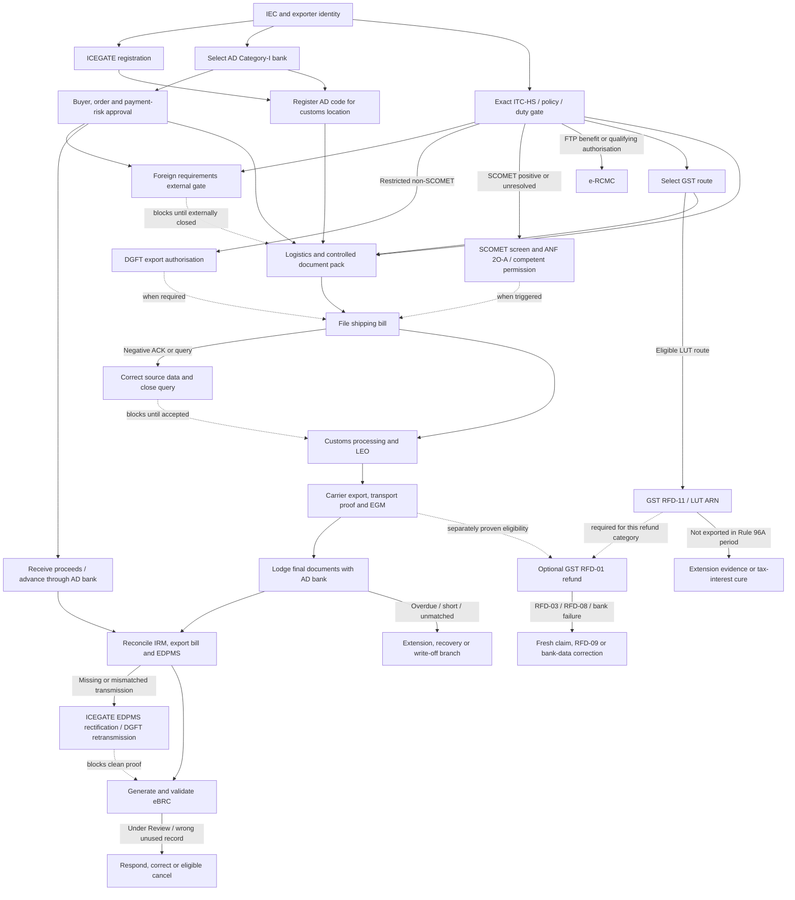

# Journey 2 — Export a first commercial goods order and complete payment realisation

Verified on: **2026-08-28 (Asia/Kolkata)**  
Pack ID: `india.export.first-goods-order`  
Readiness: **Action Required**

## Outcome and boundary

This dossier covers a Central-government-oriented path from first-export foundations through Customs export, AD-bank/EDPMS matching, payment realisation and eBRC. It covers DGFT/FTP, CBIC Customs/ICEGATE, Central GST, RBI/FEMA, the handling AD Category-I bank, and necessary private actors.

It does **not** assert a shipment's exact ITC(HS), policy status, SCOMET result, duty, regulator status, foreign-country requirements, GST refund entitlement, incentive entitlement, private charges, or bank-specific LC/collection procedure without case evidence. Foreign import rules are an external dependency. A generic current SCOMET screening/application branch is included, but the actual technical classification, approval outcome and non-SCOMET specialist regimes remain gated.

The structured source of truth is [`02-export-first-order.json`](02-export-first-order.json). It contains 27 tasks, 41 dependency edges, 54 atomic claims, 28 current official sources, and 8 classified coverage gaps. The JSON schema and semantic validator both pass with zero errors and zero warnings.

## The completion standard

Customs clearance alone is not completion. A clean ordinary completion file contains, at minimum:

1. active IEC and the required ICEGATE/bank setup;
2. shipment-specific classification/policy/duty/regulator memo;
3. signed buyer/order/payment and external foreign-requirements evidence;
4. applicable GST route and LUT ARN where used;
5. accurate shipping bill, LEO, transport document and EGM/physical-export confirmation;
6. AD-bank document-lodgement/export-bill reference;
7. matched inward remittance and EDPMS realisation reconciliation; and
8. eBRC with shipment/remittance data matched and no unresolved `Under Review` status.

### Reuse of shared foundations

This journey consumes, rather than redefines, reusable foundation artifacts. An already-issued IEC may satisfy `proof.iec` only after current active/profile and CBIC-transmission checks; approved ICEGATE credentials satisfy `proof.icegate-id` only for the correct current role; and a DSC/eSign capability is merely `input.signature` until the exact DGFT, ICEGATE or GST transaction accepts the signer/profile. A valid certificate does not by itself prove ICEGATE association or filing authority. This avoids a second, contradictory universal DSC rule and avoids duplicate IEC/ICEGATE applications.

## Fail-closed gates

- **Unknown classification or policy:** stop authorisation, duty, refund and shipping-bill conclusions.
- **Prohibited goods:** no ordinary export path.
- **Restricted non-SCOMET goods:** obtain the exact authorisation and satisfy its conditions before filing.
- **SCOMET trigger:** run the current Appendix 3 screen and ANF 2O(A)/competent-authority branch; an unknown result, draft or pending application blocks Customs. Other specialist regimes leave this pack.
- **Unresolved foreign import requirement:** stop booking/dispatch; Indian sources do not establish foreign eligibility.
- **GST payment-of-IGST proposal:** do not assume refund; verify the currently notified class of persons/goods and export-duty exclusion.
- **Unknown payer/payment/document route:** obtain AD-bank acceptance; direct dispatch is not universally allowed.
- **LEO without EGM/transport proof:** physical export is not yet proved.
- **Account credit without IRM/EDPMS match:** realisation is not yet proved.
- **Negative Shipping Bill ACK/query:** do not proceed to LEO until positive acknowledgement/current accepted status and the material query is closed.
- **Missing EDPMS/DGFT visibility:** a rectification or retransmission request is not resolution; require final system status and bank match.
- **eBRC `Under Review`, mismatched or wrongly cancelled:** documentary completion remains open until a clean usable status exists.
- **LUT invoice not physically exported in time:** require authenticated export, a Commissioner-allowed further period, or the Rule 96A tax/interest cure.
- **Refund RFD-03/RFD-08/bank failure:** use the matching fresh-application, RFD-09 or bank-update route; a reply/ARN alone is not payment.

## Bounded demo scenario

The demo is a first-time GST-registered Indian sole proprietor exporting one small batch of ordinary non-perishable, non-hazardous, non-electronic manufactured consumer goods by air. That description is deliberately **not** a tariff classification.

Before the path begins, the demo assumes:

- a qualified customs adviser signs a product-specific memo confirming the exact eight-digit ITC(HS), current `Free` policy, no export duty, and no product-specific Central licence/NOC or SCOMET trigger;
- the foreign buyer/importer supplies written destination requirements and states that no certificate of origin or preferential claim is needed;
- the buyer pays 100% advance in USD through the designated AD Category-I bank;
- the exporter uses LUT without IGST and claims no GST refund, drawback, RoDTEP, RCMC, CoO or other benefit; and
- a licensed customs broker files the air-cargo shipping bill at the AD-code-linked location.

These assumptions are not reusable conclusions. Changing product, destination, GST status, benefit claim, payer, currency, payment instrument, mode, port or entity reopens the affected gate.

## Qualifier map

| Qualifier | Decides | Stop condition |
|---|---|---|
| Entity/PAN/bank/IEC | IEC, ICEGATE, AD-bank setup | No active IEC or evidenced exemption |
| Complete product dossier | Classification, policy, duty, regulators, documents | Missing/ambiguous technical facts |
| Buyer, consignee, destination | Contract risk and foreign dependency | Identity or foreign import responsibility unresolved |
| Current policy status | Free/restricted/prohibited/SCOMET/STE branch | Prohibited or unknown; restricted without authorisation |
| GST status and route | LUT/bond versus notified IGST route | Unsupported route or refund assumption |
| Payment method/payer/currency | Advance, collection/open account, LC, third-party route | AD bank has not accepted the route |
| FTP benefit/authorisation | Conditional RCMC | Competent issuer/certificate not identified when required |
| Customs filing channel | Exporter/RES, licensed broker or Service Centre | No tested authorised submitter |
| Origin document | Preferential/non-preferential CoO | No verified agreement/rule/issuer basis |
| Credit cover | Optional ECGC/private insurance | No issued quote/policy for named risk |

## Task graph

## Verified ordinary path

| Order | Task | Actor/channel | Completion proof | Key caveat |
|---:|---|---|---|---|
| 1 | Establish entity and obtain/activate IEC | Exporter + DGFT portal | Active IEC certificate and CBIC transmission status | A receipt/draft/inactive IEC is insufficient |
| 2 | Register on ICEGATE if post-login/direct services are needed | Exporter + ICEGATE | ICEGATE ID and tested login | Live role fields are portal-version sensitive |
| 3 | Select AD Category-I bank and export account | Exporter + bank | Written bank route, branch AD code and case reference | Generic account credit is not EDPMS handling proof |
| 4 | Validate buyer, order, payment and document route | Exporter, buyer, bank, optional insurer | Signed order and risk checklist | Public sources do not prove buyer solvency |
| 5 | Determine exact ITC(HS), policy, duty and regulators | Exporter/adviser + current DGFT/Customs sources | Versioned classification/policy memo | Framework is verified; the case result is not pre-filled |
| 6 | Select GST route | Exporter + GST adviser | GST route memo | Payment-of-IGST refund is not universal |
| 7 | File LUT where eligible | GST portal | RFD-11 ARN | ARN does not establish refund entitlement |
| 8 | Register AD-code account at the customs location | ICEGATE + AD bank | Active Foreign Remittance Account entry | Bank letter alone is insufficient |
| 9 | Receive full advance for the demo | Buyer + AD bank | Credit advice and IRM data | Shipment within three years; same AD handles documents |
| 10 | Book logistics and freeze document pack | Exporter, broker, carrier, bank | Controlled four-way-consistent pack | Foreign gate and any authorisation must already be closed |
| 11 | File electronic shipping bill | Broker/exporter + ICEGATE/ICES | Shipping-bill acknowledgement and number/date | Upload/job number is not Customs acceptance |
| 12 | Complete risk-based Customs processing and obtain LEO | Customs + custodian/broker | Signed LEO and gate pass where applicable | Do not assume examination or waiver |
| 13 | Export goods and obtain transport/EGM evidence | Carrier + Customs | Final AWB/BL plus EGM/physical-export status | LEO alone is not physical export |
| 14 | Lodge shipping documents with AD bank | Exporter + AD bank | Export-bill/document-lodgement reference | Ordinary 21-day lodgement rule; EDI EC-copy exception is narrow |
| 15 | Reconcile proceeds and EDPMS | Exporter + AD bank | Matched bank/EDPMS status and reconciliation statement | Resolve deductions, short/excess or payer variance |
| 16 | Generate and validate eBRC | Exporter + DGFT + bank IRM | Clean eBRC in Bills Repository | Advance cannot generate before SB/invoice date; `Under Review` is open |

The external foreign-requirements task remains `Candidate` because no destination was researched. In the bounded demo, its artifact is supplied and closed before the verified Indian path is used; it is not represented as an Indian-government conclusion.

### Verified conditional/remediation tasks

| Trigger | Task | Completion proof | Fail-closed point |
|---|---|---|---|
| Current SCOMET screen positive or unresolved | Screen Appendix 3 and seek ANF 2O(A)/competent permission | Issued authorisation matched to item, end use/end user, destination and conditions | Procedure is Verified; the case result and approval remain Candidate |
| LUT goods not exported within Rule 96A period | Obtain evidenced further period or pay exact tax plus applicable interest | Physical-export record, Commissioner order or GST payment/return reference | LUT ARN alone does not cure timing |
| CHCAE02_NAK, CHCAE03 or non-accepted SB status | Correct controlled source data and use supported retransmission/query reply | CHCAE02_ACK/current accepted status and closed query | No LEO continuation while open |
| SB missing/wrong in EDPMS or DGFT | ICEGATE EDPMS rectification, AD-bank correction and/or DGFT retransmission | Final ICEGATE/DGFT visibility plus AD-bank matched EDPMS entry | Submitted request is not resolution |
| eBRC Under Review/wrong/unusable | Respond to Bank/Agency; eligible unused exporter eBRC may be cancelled | Final clean certificate/status and utilisation record | No cancellation of utilised or bank-generated eBRC through this route |
| RFD-03/RFD-08 or refund bank-validation failure | Fresh corrected RFD-01, RFD-09, or permitted bank-data update | New ARN/final forms, bank validation and credited payment/order as applicable | Reply or status update is not refund payment |

## Conditional branches

### Restricted or prohibited goods

Notification 50/2024-25 supplies the current harmonised all-chapter Schedule II framework. FTP/HBP supports ANF 2N for **non-SCOMET** restricted export authorisation. The issued authorisation must be checked for item, exporter, buyer/end user, quantity/value, validity, port and conditions. Prohibited goods stop.

SCOMET is now a distinct branch. Notification 31/2025-26 supplies the current revised Appendix 3 list found live, and DGFT's portal guide routes an ordinary fresh SCOMET application through Export Management System to ANF 2O(A); GAICT is the separate ANF 2O(B) path. The branch is Verified as a method, not as a classification or approval. Technical parameters, software/technology scope, end use, end user and destination must be complete; Category 0/atomic and other competent-authority regimes can leave the ordinary DGFT path.

### RCMC

RCMC is not a blanket requirement for every free-goods shipment. It is added only where an FTP authorisation (subject to the stated restricted-item exception), benefit or concession requires it. The generic portal path is `Services > e-RCMC > Apply for e-RCMC`; issuer-specific eligibility, documents, fees and membership remain case-specific.

### GST

Exports are zero-rated. A registered person may use bond/LUT without IGST and, subject to section 54/rules, seek unutilised-ITC refund. Payment-of-IGST refund is restricted to notified classes of persons or goods/services, and export-duty goods are excluded. Therefore this dossier does not expose a universal “pay IGST and refund” choice.

The optional RFD-01 refund node is `Candidate` until GST registration, returns, ledger/ITC, export-duty status, notification class, invoice, shipping bill, EGM and tax-period facts are reviewed. It is excluded from the demo happy path.

Rule 96A separately requires goods invoiced under LUT to be exported within three months, or within a further period allowed by the Commissioner. Without authenticated physical export or that further period, tax due plus applicable section 50(1) interest is payable within fifteen days after expiry. No amount is precomputed here.

Refund procedure is no longer a generic “answer the query” note. RFD-03 requires rectification and a fresh refund application; RFD-08 is answered in RFD-09 within fifteen days and proceeds to RFD-06 after hearing. A PFMS/bank-validation failure uses the permitted registration-bank correction and ARN-linked update route. None of these procedural statuses establishes entitlement or credited payment.

### Advance, open account/collection and LC

- **Demo:** 100% advance. RBI currently requires ordinary advance-backed shipment within three years and shipment documents through the same AD bank. DGFT will not allow advance eBRC before the shipping-bill/invoice date.
- **Open account/collection:** obtain the AD bank's written document route and due-date/collection handling. RBI's HAWB/FCR treatment has stated conditions and buyer-due-diligence guidance; it is not a universal transport-document substitute. Direct dispatch is not universal.
- **Irrevocable LC:** RBI recognises full irrevocable LC for specified document/direct-dispatch cases, but bank-specific LC text, examination, discrepancies, charges and credit decisions are private evidence.
- **Late bank documents:** an AD bank may handle them when satisfied with the reason under C.7; that is a remediation power, not a default extended deadline.
- **Third-party payment:** RBI requires the irrevocable-order/tripartite or permitted substitute evidence, AD-bank bona-fides/export-document review, banking-channel receipt and payer declaration. The exporter remains responsible for realisation/repatriation.
- **Small EDPMS entry:** for an entry/bill of INR 10 lakh equivalent or less, C.31 puts exporter-declaration reconciliation in the AD bank's hands and bars penal charges for regulatory delay. It is not exporter self-closure.

### ICEGATE, EDPMS and eBRC rejection/status handling

ICEGATE's current message register distinguishes `CHCAE02_ACK`, `CHCAE02_NAK`, `CHCAE03` and `CACHE04`; a negative acknowledgement or open material query blocks the LEO path. Current Shipping Bill enquiry exposes present and EGM status.

For system reconciliation, use Shipping Bill in RBI-EDPMS to check Customs transmission, the authenticated rectification route for a Customs-side status defect, and the AD bank for IRM/export-bill reporting. If the Shipping Bill is missing at DGFT, ICEGATE's post-login DGFT Retransmission Facility accepts SB date/number, port code and IEC and exposes a retransmission-status enquiry. Each request must reach final system visibility; submission alone is not proof.

DGFT's eBRC guide now supports three distinct exception checks: `Under Review` via Respond to Bank/Agency, IRM Utilisation Report, and cancellation only of an unused exporter-generated eBRC. A utilised exporter eBRC or bank-generated eBRC cannot use that cancellation route. Final clean certificate/status remains the documentary completion standard.

### Overdue or non-realisation

The ordinary realisation period is nine months from export for this bounded ordinary route. AD banks must follow overdue bills. They may grant extensions up to six months at a time when RBI C.20 conditions are met; uncovered cases go through the AD bank to the RBI Regional Office. Write-off requires the exact current C.23 conditions, evidence, applicable limits, incentive surrender and EDPMS reporting.

If an unutilised-ITC export refund was received and proceeds are not realised, IGST Act section 16(3) creates a deposit-and-interest consequence after the FEMA period. FTP benefits can also have to be returned. A rupee insurance settlement is not automatically foreign-exchange realisation.

## Portal routes

| Portal transaction | Public URL / navigation | Proof | Exception route |
|---|---|---|---|
| DGFT new IEC | [DGFT](https://www.dgft.gov.in/CP/) > Apply for IEC | IEC certificate, payment reference, CBIC transmission | Submitted-request status, DGFT helpdesk/RA |
| ICEGATE registration | [Registration index](https://www.icegate.gov.in/icegate-services/registration) > Registration on ICEGATE | ICEGATE ID/acknowledgement | Registration enquiry/helpdesk |
| Restricted export | [DGFT](https://www.dgft.gov.in/CP/), online non-SCOMET ANF 2N transaction | File number and issued authorisation | Official deficiency/review path |
| SCOMET export | DGFT > Export Management System > Export of Restricted Items > SCOMET > ANF 2O(A) | File number and issued authorisation/conditions | Deficiency route; GAICT/Category 0/other authority split |
| e-RCMC | DGFT > Services > e-RCMC > Apply for e-RCMC | Application and certificate | Issuer/DGFT e-RCMC route |
| LUT | [GST](https://www.gst.gov.in/) > FORM GST RFD-11 | ARN | Rule 96A physical-export/extension/tax-interest remediation |
| AD-code account | [ICEGATE advisory](https://www.icegate.gov.in/guidelines/ad-code-bank-account-registration-advisory) > Bank Account > Foreign Remittance Account | Account/location success status | Modify/reverify; bank + ICEGATE helpdesk |
| Shipping bill | [ICEGATE e-filing messages](https://www.icegate.gov.in/guidelines/e-filing-messages) using supported filer/RES/Service Centre | Positive ACK, number and accepted status | Negative ACK/query reply/amendment/helpdesk |
| LEO download | ICEGATE Download e-Copy > Let Export Order | Signed LEO copy | Verify job/location, then helpdesk |
| SB in RBI-EDPMS | ICEGATE Enquiries > Shipping Bill in RBI-EDPMS | Transmission/final status | Post-login Rectification of SB in RBI-EDPMS or AD-bank correction |
| SB retransmission to DGFT | ICEGATE > Enquiries > DGFT > DGFT Retransmission Facility (SB) | Request and final retransmission status | ICEGATE then DGFT helpdesk with references |
| GST refund | [GST refund guide](https://tutorial.gst.gov.in/userguide/refund/Refund_of_ITC_paid_on_Exports_of_Goods_and_Services_without_payment_of_Integrated_Tax.htm) > RFD-01 | ARN, final order and credited payment/status | RFD-03 fresh filing, RFD-09, bank update or appeal |
| eBRC | DGFT > Services > eBRC / Bills Repository | Clean eBRC and utilisation/status | Respond to Bank/Agency; eligible cancel; bank/EDPMS correction |

## Atomic claim register

`Verified` claims may drive tasks. `Candidate` claims remain visible gates.

| Claim | Status | Proposition | Primary locator |
|---|---|---|---|
| `claim.iec-required` | Verified | IEC ordinarily mandatory for goods export | Updated FTP Ch.2, 2.05 |
| `claim.iec-portal` | Verified | Current DGFT online IEC inputs/sign/payment/certificate flow | IEC Manual v4.1, §5 pp.8-18 |
| `claim.iec-fee` | Verified | New IEC manual states INR 500 | IEC Manual v4.1, §5 step 10 p.17; recheck live |
| `claim.docs-minimum` | Verified | Transport receipt, invoice-cum-packing list, shipping bill baseline | Updated FTP Ch.2, 2.06 |
| `claim.policy-default-free` | Verified | Free except ITC(HS), FTP or other-law regulation | FTP 2023, 2.40 |
| `claim.policy-schedule` | Verified | Notification 50/2024-25 notified harmonised all-chapter Schedule II | Notification 50/2024-25, paras 1-4 |
| `claim.classification-case` | Candidate | Exact case code/policy/SCOMET/duty/regulator unresolved without product facts | Framework only; no case dossier |
| `claim.restricted-application` | Verified | Restricted applications online; ANF 2N for non-SCOMET | HBP Ch.2, 2.03 and 2.68 |
| `claim.scomet-list` | Verified | Notification 31/2025-26 revised current Appendix 3 SCOMET list | Notification 31/2025-26 + annexure |
| `claim.scomet-portal` | Verified | Ordinary fresh SCOMET authorisation uses ANF 2O(A); GAICT uses 2O(B) | SCOMET Portal Guide v4.0 |
| `claim.scomet-case` | Candidate | Exact technical control and approval result absent | No product/end-use/end-user dossier |
| `claim.rcmc-conditional` | Verified | RCMC is conditional on identified authorisation/benefit/concession | Updated FTP Ch.2, 2.57; e-RCMC manual |
| `claim.ecgc-optional` | Verified | ECGC may cover specified commercial/political risks | Updated FTP Ch.2, 2.55 |
| `claim.gst-zero-rated` | Verified | Goods exports are zero-rated | IGST Act, 16(1)(a) |
| `claim.gst-lut-refund` | Verified | Registered person may seek unutilised-ITC refund under bond/LUT | IGST Act, 16(3) |
| `claim.gst-igst-limited` | Verified | IGST-paid refund needs notified class; export-duty goods excluded | IGST Act, 16(4)-(5) |
| `claim.gst-lut-submit` | Verified | RFD-11 portal ARN means LUT acceptance | Circular 40/14/2018, para 2(c)-(e) |
| `claim.gst-lut-breach` | Verified | Goods export within 3 months/further allowed period or tax-interest cure | CGST Rule 96A(1)-(3) |
| `claim.gst-refund-portal` | Verified | RFD-01 workflow uses SB/EGM/returns and ARN tracking | GST portal refund guide, FAQ 1 |
| `claim.gst-refund-remediation` | Verified | RFD-03 fresh corrected filing; RFD-08 answered by RFD-09 in 15 days | Refund Rules + Circular 125/44/2019 |
| `claim.gst-refund-bank-validation` | Verified | Correct registration bank data then use ARN-linked update and track PFMS | GST refund tracking advisory |
| `claim.gst-refund-case` | Candidate | Exact refund entitlement/amount not established | No taxpayer return/ledger facts |
| `claim.gst-nonrealisation` | Verified | Received export ITC refund has non-realisation deposit consequence | IGST Act, 16(3) proviso |
| `claim.icegate-registration` | Verified | ICEGATE registration enables filing/ID/tracking/acknowledgements | Registration FAQ v1.01 + current index |
| `claim.ad-code-portal` | Verified | Foreign Remittance Account captures bank/AD code/account/location/proof | AD-code advisory steps 1-6 |
| `claim.shipping-bill-messages` | Verified | CACHE01, positive/negative ACK, query and query-reply are distinct flows | ICEGATE e-Filing Messages + ICES v3.3 |
| `claim.shipping-bill-status` | Verified | ICEGATE exposes SB current and EGM status enquiry | Current ICEGATE FAQ |
| `claim.icegate-edpms-rectification` | Verified | Public SB-EDPMS status and authenticated rectification/FE detail route | EDPMS advisory + Public Enquiries v1.01 |
| `claim.icegate-dgft-retransmission` | Verified | Missing DGFT SB can be retransmitted and status tracked | DGFT Re-Transmission Manual v0.2 |
| `claim.customs-rms-leo` | Verified | Risk processing precedes applicable checks and LEO | Customs Manual 2025, Ch.2 export flow |
| `claim.egm-carrier` | Verified | Carrier/agent files SB-wise EGM; it confirms physical export | Customs Manual 2025, 25.3 and 26.1 |
| `claim.leo-download` | Verified | ICEGATE e-Copy downloads signed LEO by date/job | Download Utility v1.08, 2.2-2.2.2 |
| `claim.rbi-contract-currency` | Verified | Contract/invoice currency may be freely convertible or INR subject to route | RBI Master Direction A.1(v) |
| `claim.rbi-receipt-ad` | Verified | Full export value received through AD bank under permitted manner | RBI A.3(i) |
| `claim.rbi-third-party` | Verified | Third-party payer needs prescribed order/evidence, bank review, declaration and banking channel | RBI A.3(v), B.8 |
| `claim.rbi-realisation-nine` | Verified | Ordinary realisation/repatriation period is nine months | RBI A.2(i) |
| `claim.rbi-advance-three` | Verified | Ordinary advance shipment within three years; same AD documents | RBI C.2(1), updated 17-Jul-2026 |
| `claim.rbi-documents-21` | Verified | Ordinary 21-day bank lodgement; narrow integrated-EDI EC-copy exception | RBI B.1-B.2 |
| `claim.rbi-document-routing` | Verified | HAWB/FCR, late documents and direct dispatch have distinct RBI conditions | RBI B.11, C.7, C.10 |
| `claim.rbi-direct-dispatch` | Verified | Direct dispatch only on supported advance/LC/AD-accepted route | RBI C.10 |
| `claim.buyer-due-diligence` | Verified | RBI guidance advises buyer due diligence in identified document-risk case | RBI B.11(ii)(b) |
| `claim.rbi-edpms` | Verified | AD bank reports/updates EDPMS and bank-side eBRC derives from EDPMS | RBI B.1(v), C.14-15, C.30 |
| `claim.rbi-small-edpms` | Verified | Entries up to INR 10 lakh use AD-bank declaration reconciliation; no penal delay charge | RBI C.31 |
| `claim.rbi-overdue` | Verified | AD bank follows overdue bills and reports unresolved failure | RBI C.15 |
| `claim.rbi-extension` | Verified | AD may extend six months at a time under conditions | RBI C.20 |
| `claim.rbi-writeoff` | Verified | Write-off needs current limits, evidence, categories and EDPMS reporting | RBI C.23.1-C.23.10 |
| `claim.ebrc-self` | Verified | Exporter self-generates eBRC from bank IRM on DGFT | eBRC Guide v1.2, intro + §6 |
| `claim.ebrc-advance-link` | Verified | Advance eBRC waits for SB/invoice date and uses SB/AD data | eBRC Guide v1.2, pp.4, 11-15 |
| `claim.ebrc-review` | Verified | `Under Review` IRM unusable; respond via Bank/Agency route | eBRC Guide v1.2, §9 pp.28-30 |
| `claim.ebrc-cancellation` | Verified | Only unused exporter-generated eBRC can use portal cancellation | eBRC Guide v1.2, §7 pp.21-25 |
| `claim.ebrc-utilisation` | Verified | Repository and IRM Utilisation Report expose use/status | eBRC Guide v1.2, pp.20-27 |
| `claim.ftp-nonrealisation` | Verified | Unrecovered proceeds can require FTP benefit return | Updated FTP Ch.2, 2.54 |
| `claim.foreign-case` | Candidate | Foreign requirements absent from India-Central research | External dependency by scope |
| `claim.bank-charges-case` | Candidate | Private/regulated charges require provider quote | No tariff/quote supplied |

## Conflicts

No unresolved authoritative conflict was admitted. RBI's bank-side EDPMS/eBRC direction and DGFT's current exporter-facing self-generation guide are treated as layered responsibilities: the AD bank reports and updates the remittance/export data; the exporter initiates current DGFT eBRC generation from the IRM and responds to any review. Any live data mismatch remains an action gate rather than being resolved by inference.

## Coverage gaps (8)

Resolved procedural gaps are no longer listed as gaps: the all-chapter Schedule II baseline, generic SCOMET application branch, Shipping Bill negative-ACK/query status, ICEGATE EDPMS/DGFT retransmission, eBRC review/cancellation/utilisation, Rule 96A timing cure, and GST refund deficiency/rejection/bank-validation routes now have Verified claims/tasks. Every remaining row is expressly classified as **Narrowed** or **Irreducible**.

| Gap | Disposition | Safe treatment | Resolution |
|---|---|---|---|
| Exact classification, policy, SCOMET, duty and regulator result | Narrowed | Current all-chapter/SCOMET frameworks resolved; block case conclusions | Complete product dossier + current official-source memo |
| Foreign import/product/sanctions/labels/origin/tax requirements | Irreducible external dependency | External blocking dependency | Buyer/importer or competent foreign authority/professional evidence |
| State/local entity, premises, factory, pollution, storage and transport approvals | Irreducible without location facts | Do not infer Central readiness satisfies local law | Separate location/activity review |
| Bank/insurer/EPC/broker/freight/terminal charges | Irreducible private evidence | No numeric estimate beyond verified IEC fee | Written dated tariffs/quotes |
| Advance/open-account/collection/LC operational detail | Narrowed | RBI branches resolved; bank checklist remains private | Selected AD-bank written transaction instructions |
| Shipment-specific GST refund eligibility and amount | Narrowed | Procedure/remediation resolved; entitlement excluded from happy path | Taxpayer returns/ledger/LUT/SB/EGM review |
| SCOMET case and other specialist controlled/product regimes | Narrowed | Generic SCOMET list/application resolved; block unknown specialist result | Complete SCOMET dossier or regime-specific review/licence |
| Certificate of origin/preference | Irreducible without destination/product claim | No preference or CoO assumption | Agreement/product-origin rule and issuer verification |

## Primary source register

All sources were reopened or located on the competent official site on 2026-08-28. Search snippets and prior project research were used only for discovery, never as evidence.

1. DGFT, [Updated FTP Chapter 2](https://content.dgft.gov.in/Website/dgftprod/9158887c-cdfb-4312-92f1-15eeb8e8aa70/%5BUPDATED%5D%20CHAPTER%202%20OF%20FTP.pdf), especially 2.05-2.06 and 2.54-2.57.
2. DGFT, [Foreign Trade Policy 2023](https://content.dgft.gov.in/Website/dgftprod/61d61bc2-272e-4880-b96c-c8f685a3b244/Foreign%20Trade%20Policy%202023.pdf), especially 2.40.
3. DGFT, [Handbook of Procedures Chapter 2](https://content.dgft.gov.in/Website/dgftprod/38d98f53-86e0-4cf7-98db-834864a08524/HBP2023_Chapter02.pdf), especially 2.03 and 2.68.
4. DGFT, [Notification 50/2024-25 — harmonised all-chapter Schedule II](https://content.dgft.gov.in/Website/Notification_ITCHS.pdf), paragraphs 1-4.
5. DGFT, [Notification 31/2025-26 — revised Appendix 3 SCOMET list](https://content.dgft.gov.in/Website/dgftprod/66297819-5587-417b-a780-d8fa2ba326fe/Notification%2031%202025-2026%20updation%20in%20scomet%20list.pdf).
6. DGFT, [SCOMET User Help File v4.0](https://content.dgft.gov.in/Website/DGFT-SCOMET_Exports_%28IEA%29_User_Help_Manual_Version_4.0.pdf), ANF 2O(A)/2O(B) portal split.
7. DGFT, [IEC Module User Help File v4.1](https://content.dgft.gov.in/Website/IEC_Manual_V4.1.pdf), §5 pp.8-18.
8. DGFT, [e-RCMC Customer Portal User Help File v4.0](https://content.dgft.gov.in/Website/e-RCMC_Customer_Portal_User_Help_File_v4.0.pdf).
9. DGFT, [eBRC User Guide for Exporters v1.2](https://content.dgft.gov.in/Website/Exporter_manual_e-BR_%20v1.1.pdf), §§6-9. (The hosted filename says v1.1; the title/body say v1.2.)
10. CBIC, [IGST Act section 16](https://taxinformation.cbic.gov.in/content-page/explore-act/1000624/1000001/section%2016/ACTS).
11. CBIC, [Circular 40/14/2018-GST](https://cbic-gst.gov.in/pdf/circularno-40-cgst.pdf), para 2(c)-(e).
12. CBIC, [CGST Rules consolidated copy — Rule 96A](https://cbic-gst.gov.in/pdf/01062021-CGST-Rules-2017-Part-A-Rules.pdf).
13. GST Portal, [Refund of ITC on exports without payment of IGST](https://tutorial.gst.gov.in/userguide/refund/Refund_of_ITC_paid_on_Exports_of_Goods_and_Services_without_payment_of_Integrated_Tax.htm).
14. CBIC, [GST Refund Rules](https://cbic-gst.gov.in/gst-refund-rules.html), deficiency/order/re-credit provisions.
15. CBIC, [Circular 125/44/2019-GST](https://cbic-gst.gov.in/pdf/circular-cgst-125.pdf), electronic refund processing.
16. GST Portal, [Refund tracking and PFMS bank-validation advisory](https://tutorial.gst.gov.in/downloads/news/Advisory_on_Refund_Tracking.pdf).
17. CBIC/JNCH, [Customs Manual 2025](https://www.jawaharcustoms.gov.in/pdf/customs-manual-website-menu/Customs-Manual.pdf), Chapter 2.
18. ICEGATE, [Registration FAQ v1.01](https://www.icegate.gov.in/sites/default/files/2023-12/Registration-FAQ%20%281%29.pdf).
19. ICEGATE, [Current registration index](https://www.icegate.gov.in/icegate-services/registration).
20. NIC/ICES, [CHA-Customs Exports Message Format v3.3](https://www.icegate.gov.in/sites/default/files/2026-03/ICES_1.5_CHA_Customs_Exports_Mesg_Format_Ver_3.3.pdf).
21. ICEGATE, [e-Filing Messages](https://www.icegate.gov.in/guidelines/e-filing-messages), dated 08-May-2026.
22. ICEGATE, [Current FAQ](https://www.icegate.gov.in/help/faq), Shipping Bill enquiry/status route.
23. ICEGATE, [Public Enquiries User Manual v1.01](https://www.icegate.gov.in/sites/default/files/2026-02/User%20Manual-Public%20Enquiries_v1.01.pdf), §5.3.
24. ICEGATE, [Shipping Bill EDPMS Enquiry/Rectification advisory](https://www.icegate.gov.in/sites/default/files/2022-04/Advisory_for_SB_EDPMS_Enquiry.pdf).
25. ICEGATE, [DGFT Shipping Bill Re-Transmission Manual v0.2](https://www.icegate.gov.in/sites/default/files/2025-02/DGFT%20Re-Transmission_User%20Manual_V0.2_0.pdf).
26. ICEGATE, [Download Utility v1.08](https://www.icegate.gov.in/sites/default/files/2024-03/User%20Manual%20-%20Download%20Utility%20v1.08.pdf), LEO sections.
27. ICEGATE, [AD Code Bank Account Registration Advisory](https://www.icegate.gov.in/guidelines/ad-code-bank-account-registration-advisory), live page dated 25-Aug-2026.
28. RBI, [Master Direction — Export of Goods and Services](https://www.rbi.org.in/Scripts/BS_ViewMasDirections.aspx?id=10395), updated 17-Jul-2026.
