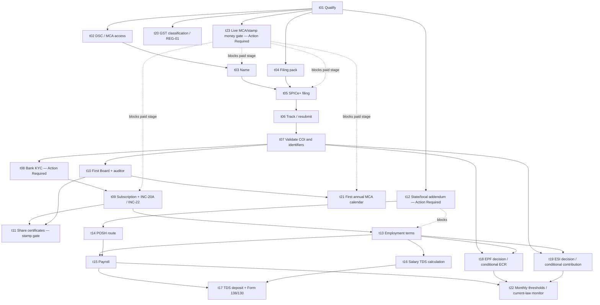

# Journey 3 — incorporate an Indian company and hire the first employee

Verification date: **2026-08-28 (Asia/Kolkata)**  
Pack ID: `journey3.incorporate-hire.india-central`  
Readiness: **Action Required**

## Outcome and boundary

This dossier models a qualifier-driven route from entity/director/name/capital choices through MCA incorporation, the first hire, payroll and the first applicable Central remittances/filings. The bounded demo is a two-founder Indian private company limited by shares, ordinary services activity and one non-director employee.

The Central path covers the Companies Act and MCA21; PAN/TAN and salary TDS under the **Income-tax Act, 2025** for salary paid from 1 April 2026; conditional GST; current post-commencement labour-code instruments; EPFO/ESIC applicability and operational filings; and the Central POSH baseline. The JSON file is the normalized, ingestion-ready record with exact atomic mappings.

The following are **not national procedures** and remain explicit state/local gates: Shops and Establishments, professional tax, trade licence, labour welfare fund, state minimum wages/leave/working hours, local establishment permissions, the workplace District Officer/Local Committee contact, and stamp duty on incorporation/share/lease/employment instruments. The pack also does not cover foreign investment, Section 8/producer-company, regulated-sector approvals or public-company-specific governance beyond the qualifiers.

## Critical current-law findings

1. The four labour codes are in force from **21 November 2025**, but the old scheme/rule checkpoint is no longer controlling. **G.S.R. 344(E)** made the Social Security (Central) Rules, 2026 effective on **8 May 2026** and expressly superseded the ESI Central Rules 1950. **G.S.R. 525(E)** made the Employees' Provident Funds Scheme, 2026 effective on **29 June 2026** and expressly superseded EPF Scheme 1952. The old materials are retained only as Stale historical sources.
2. New companies receive/apply for EPFO and ESIC identifiers through SPICe+/AGILE-PRO-S, but MCA expressly distinguishes identifier issuance from contribution compliance: contributions begin only if the applicable establishment and employee conditions are met.
3. For an ordinary services establishment, EPF starts at 20 employees; ESI ordinarily starts at 10 persons, with a special notified hazardous/life-threatening occupation branch that can apply even with one employee. The demo's one non-hazardous worker triggers neither ordinary contribution path. Its salary is not used to reach the ESI establishment result.
4. Current EPF mechanics are verified directly from Scheme 2026: membership paragraph 9, 12% ordinary contributions in paragraph 18, voluntary contributions in paragraph 19, and payment within 15 days after month close in paragraph 20. **S.O. 2702(E)** independently fixes the Chapter III wage ceiling at INR 15,000 per month.
5. Current ESI Rules 2026 rule 18 requires registration of a covered employee before or on the day employment starts and completion of declaration/Aadhaar details; rule 19 fixes 3.25% employer and 0.75% employee contributions and provides the specified disability employer-share relief. A current numeric **Chapter IV** wage-ceiling notification was not located: S.O. 2351(E) supplies contribution-period continuation only and no amount. The old Rule 50 INR 21,000/25,000 values and legacy FAQ cannot decide current eligibility.
6. ESI General Regulation 31 is a narrower current transition than the superseded Rules: Code section 164(2) saves it, G.S.R. 344(E) did not name the General Regulations, and ESIC used another saved General Regulation after Code commencement. As of the verification date it requires payment within 15 days after calendar-month end; recheck before any payment on or after **20 November 2026** or earlier replacement. This does not revive Rule 50 or any other superseded ESI Central Rule.
7. MCA sources now verify the **component split**, not a reusable total: SPICe+ consolidates Central form/MOA/AOA/PAN/TAN components while stamp duty is state-dependent. Use Enquire Fee and the final live filing calculation. Name defects have a rule 9 fifteen-day cure; SPICe+ incorporation has the FAQ's maximum-two resubmissions; INC-20A is STP and has **no resubmission provision**; annual forms follow their own status/notice.
8. GST is not a turnover-only decision. The verified gate applies CGST Act sections 22, 23 and 24—turnover, non-liability/exemption notifications and compulsory categories—before section 25/REG-01. The actual case remains Candidate until private facts and current notifications are matched.
9. Salary paid from 1 April 2026 is deducted under Income-tax Act, 2025 section 392. The current salary statement/certificate are **Form 138** and **Form 130**, not legacy Form 24Q/Form 16. Form 138 supports Regular/Correction FVU uploads; sections 398 and 427 prove default interest and the capped INR 200-per-day late-statement fee.
10. The OSH Code's ordinary establishment threshold is 10 workers. Its appointment-letter duty is therefore not treated as a universal Central one-worker form. The demo's signed employment terms remain a private/state-qualified gate.

## Qualifying questions

| ID | Question | Blocking effect |
|---|---|---|
| `q.entity` | OPC, private, public, Section 8, producer company or unknown? | Blocks constitutional documents and subtype selection; non-standard types leave the demo path. |
| `q.people` | Number of members/directors and which director satisfies the India-stay test? | Blocks filing if member/director minima or the resident-director condition fail. |
| `q.foreign-regulated` | Foreign person/entity, foreign investment, non-profit/producer or regulated activity? | Any positive/unknown answer requires specialist evidence. |
| `q.office` | State, full registered-office address and whether it equals correspondence address? | Determines ROC, office evidence, INC-22 branch and state/local/stamp gates. |
| `q.capital` | Authorised/subscribed capital and share allocation? | Must reconcile MOA, filing, subscription funding and certificates; live fee calculation only. |
| `q.name-route` | Separate Part A or integrated Part A plus Part B? | Separate Part A permits two names and a 20-day reservation; integrated route permits one. |
| `q.bank` | Which bank is currently selectable in the live AGILE-PRO-S form? | No archived bank list is admitted; bank activation remains incomplete until bank KYC proof. |
| `q.gst` | Supply, place, channel, turnover and compulsory-trigger facts? | No GST yes/no conclusion until sections 22, 23 and 24 plus current notifications are applied to the actual case. |
| `q.hire-type` | Employee, director-employee, contractor, apprentice or unknown? | Blocks payroll until the actual relationship is classified. |
| `q.workplace` | Employee state/remote-work location and total worker/person headcount? | Drives state/local, OSH, POSH, EPF and ESI branches. |
| `q.hazard` | Notified hazardous or life-threatening occupation? | Unknown blocks a below-10 no-ESI result. |
| `q.epf-person` | Basic wages plus DA and prior UAN/EPF membership? | Prior members cannot be excluded merely because current pay exceeds the entry ceiling. |
| `q.esi-person` | ESI wages, disability status and work location? | If establishment coverage applies, locate the current Chapter IV ceiling; Rule 19 disability relief is separate and the notified area/benefit date must be verified. |
| `q.salary-tax` | Projected Tax Year 2026-27 salary, evidence/declarations and estimated tax? | No invented TDS amount; compute before payment. |
| `q.posh` | Workers at each workplace and official District Officer/Local Committee route? | Below 10, publish the competent local route; at 10 or more, constitute the Internal Committee. |

## Dependency graph

## Task ledger and atomic mappings

`Verified` means the core public proposition is supported. A task may still contain a separately labelled Candidate fee, state dependency or private fact.

| Task | Class / status | Trigger and verified route | Inputs → completion proof | Tracking, rejection and escalation |
|---|---|---|---|---|
| `t01.qualify` | Eligibility / **Verified** | Intent to incorporate; resolve form, people, residence, office, capital, activity and exceptions. | `i.entity-facts`, `i.people-facts`, `i.activity-facts`, `i.capital-table`, `i.office-facts` → `p.qualification-record` | Dated decision; non-standard facts to eligible professional. |
| `t02.dsc` | Identity + regulated private / **Verified** | Known signatories; obtain current CA-issued DSC and valid MCA association. | `i.people-facts`, `i.identity-address` → `p.dsc-ready` | CA support for KYC/certificate; MCA help for portal association. Provider fee/time Candidate. |
| `t03.name` | Submission / **Verified** | Chosen objects/subtype; Part A separate or integrated. | `i.entity-facts`, `i.activity-facts`, `i.proposed-names` → `p.name-approval` | MCA SRN; rule 9 allows a fifteen-day defect cure when returned. After rejection/expiry use the appropriate fresh route. `t23` controls money. |
| `t04.prepare` | Document preparation / **Verified** | Final entity/people/office/capital facts. | Filing evidence and office/identity/capital inputs → `p.filing-pack` | Indexed checklist; professional resolves inconsistencies. |
| `t05.incorporate` | Submission/registration / **Verified** | Valid name route and complete pack. File SPICe+ Part B, eMOA/eAOA, INC-9 and AGILE-PRO-S. | `i.filing-pack`, `i.bank-choice`, `i.gst-decision` → `p.mca-srn`, `p.payment-receipt` | Track transaction/SRN; maximum two SPICe+ incorporation resubmissions per FAQ. Ticket technical/payment defects; CRC/ROC/professional handles substance. `t12` owns state integrations and `t23` money. |
| `t06.track-mca` | Tracking/remediation / **Verified** | Pending/returned/rejected SRN. | `i.mca-notice`, `i.filing-pack` → `p.mca-status` | Notice deadline controls; preserve notice, revised pack, ticket and order as one trail. Track the MCA service request and escalate record-specific issues with SRN evidence. |
| `t07.outputs` | Verification / **Verified** | ROC approval. Validate COI/CIN/PAN/TAN, EPFO/ESIC identifiers and bank reference. | `i.mca-notice` → `p.coi`, `p.pan-tan`, `p.social-identifiers`, `p.bank-reference` | Reconcile all names/dates/IDs; route missing output to its issuer. |
| `t08.bank` | Regulated private / **Candidate** | MCA-linked bank referral. Complete company/signatory/beneficial-owner KYC. | `i.coi-identifiers`, `i.identity-address`, `i.beneficial-owners` → `p.bank-active` | Selected bank status/grievance route. No bank, price or SLA hard-coded. |
| `t09.commence` | Submission / **Verified** | Active account and share-capital company. Receive subscriptions; file INC-20A; complete INC-22 if needed. | Capital, bank and office proofs → `p.subscription-money`, `p.inc20a`, `p.office-verification` | 180 days for INC-20A; office verification within 30 days. INC-20A is STP and has no resubmission provision: pre-validate, then use ticket/ROC correction for an erroneous record. |
| `t10.governance` | Periodic/company / **Verified** | Incorporation. First Board meeting and first auditor. | `i.coi-identifiers`, `i.board-agenda`, `i.auditor-consent` → `p.board-minutes`, `p.auditor-appointment` | First Board and Board auditor appointment within 30 days; statutory member fallback if Board misses auditor deadline. |
| `t11.shares` | Documents / **Candidate** | Subscription and Board record. | Capital/bank/Board inputs → `p.share-certificates` | Central two-month delivery verified; state stamp treatment unresolved. |
| `t12.state-local` | State/local / **Candidate** | Office and worker location known. | `i.office-facts`, `i.employment-facts` → `p.state-local-clearance` | Separate official state/local addendum. Never use MCA as proof of state duty completion. |
| `t13.contract` | Private employment / **Candidate** | Company may commence and state rules resolved. | Employment/employee tax/social inputs → `p.employment-record` | Signed actual-facts terms. No universal Central form for demo's one-worker office. |
| `t14.posh` | Employment / **Verified** | Workplace/hire. Section 19 prevention duties; Local Committee below 10, Internal Committee at 10+. | `i.employment-facts`, `i.posh-local-route` → `p.posh-record` | District/state contact must be official; protect complaint confidentiality. |
| `t15.payroll` | Payroll / **Verified** | Work performed in monthly wage period after the state-qualified baseline from `t12`/`t13` exists. | Employment, bank, tax/social inputs → `p.payroll`, `p.salary-payment` | Core claims are only the verified Central wage-period, payment and deduction rules; state wage/form rules remain in `t12`. |
| `t16.tds-calc` | Payroll/classification / **Verified** | Salary payment from 1 April 2026. | `i.coi-identifiers`, `i.employee-tax`, `i.employment-facts` → `p.tds-working` | Section 392 computation; no invented amount; correct PAN/declarations and adjust lawfully in year. |
| `t17.tds-report` | Periodic/payment / **Verified** | Salary TDS actually deducted. | `i.tds-ledger`, employee/company tax data → `p.tds-challan`, `p.form138`, `p.form130` | Form 138 Regular/Correction FVU; cure version/TAN/type/RRR rejection, pay section 398/427 defaults where actual, then regenerate Form 130. |
| `t18.epf` | Eligibility + conditional filing / **Verified** | Hire/headcount change. | Company, headcount, prior UAN and EPF payroll data → `p.epf-decision`; if covered `p.epf-ecr` | 20-employee threshold. Apply Scheme 2026 and S.O. 2702(E); use current UAN-based revamped-ECR validation/conditional-revision mechanics and pay within 15 days. |
| `t19.esi` | Eligibility + conditional filing / **Candidate** | Hire/headcount/hazard/notification change. | Company, headcount, wages, disability and geography → `p.esi-decision`; if covered `p.esi-contribution` | 10-person threshold/hazard branch; Rules 18-19 current. Ceiling remains missing. Saved Regulation 31 verifies the current 15-day due date only until earlier replacement/end of savings. |
| `t20.gst` | Classification/registration / **Candidate** | Before AGILE choice and on supply/turnover change. | Activity/GST/office/company inputs → `p.gst-decision`; if liable `p.gst-registration` | Apply sections 22 → 23 → 24, then REG-01/ARN and REG-03/04/05/06. Actual result needs current notifications and private facts. |
| `t21.annual` | Periodic MCA / **Verified** | First financial year. | `i.accounts`, `i.auditor-consent`, company IDs → `p.annual-calendar`, `p.annual-filings` | AGM/30-day statements/60-day return. Track each SRN and actual form notice; do not transplant SPICe+'s two-resubmission rule. Ticket technical defects, escalate substance to auditor/CS/ROC. |
| `t22.monitor` | Periodic eligibility / **Verified** | Monthly/before a headcount, wage, hazard or social-security-law change. | Employment and employee-social facts → `p.threshold-review` | Use current 2026 scheme/rules; 20 Nov is not a switch for superseded Rules/Scheme, but is a separate saved-Regulation-31 recheck for affected ESI payments. |
| `t23.mca-money` | Payment/classification / **Candidate** | Before paying at a name, incorporation, INC-20A/INC-22 or annual stage, once form, capital, state and instrument are known. | `i.entity-facts`, `i.capital-table`, `i.office-facts` → `p.mca-money-gate` | Central/state component split verified. Reconcile Enquire Fee and final filing calculation with competent state stamp evidence; never reuse another case's total. |

## Portal journeys

| Journey | Official route | Authentication and proof | Exception/limitation |
|---|---|---|---|
| MCA21 | [MCA](https://www.mca.gov.in/) | Registered user/DSC; SPICe+, linked forms, INC-20A/INC-22 and annual company forms. Use Enquire Fee before payment and Track Transaction Status/SRN after filing; retain calculation, receipt, notice, revised filing, certificate and acknowledgement. | Dynamic/login-gated. The final total, bank list and record-specific notice deadline come from the live transaction. Name, incorporation, INC-20A and annual forms have different cure rules; use the actual notice, then an MCA ticket for technical/payment defects and CRC/ROC/professional escalation for substance. |
| Integrated bank | Bank selected only from live AGILE-PRO-S | Company/signatory/beneficial-owner KYC; active account proof. | No bank URL or SLA is universal; follow selected bank first-party route. |
| Income Tax | [Income Tax e-filing](https://www.incometax.gov.in/iec/foportal/) | TAN/company access; Income-tax Act, 2025 challan and Form 138 Regular/Correction FVU upload. Retain challan, acknowledgement, rejection reason, correction RRR and View Filed Forms status. | Amount depends on employee case. Cure FVU-version, TAN, upload-type and RRR mismatches; sections 398/427 govern actual default interest/late fee. Use the portal grievance categories for unresolved statement, challan, default or TRACES defects. |
| TRACES | [TRACES](https://www.tdscpc.gov.in/) | TAN deductor after Form 138 processing; obtain TRACES-generated Form 130. | Login-gated; correct underlying statement first. |
| EPFO | [Unified employer portal](https://unifiedportal-emp.epfindia.gov.in/epfo/) | Employer credentials; UAN/member, revamped ECR validation and conditional revision controls, TRRN/challan and payment. | Login-gated; [EPFiGMS](https://epfigms.gov.in/) for grievances. Portal mechanics do not replace Scheme 2026 eligibility/rate/due-date law or S.O. 2702(E). |
| ESIC | [ESIC portal](https://portal.esic.gov.in/) | Employer credentials; covered-employee enrolment, monthly contribution, challan, contribution history, delay-interest and correction controls. | Login-gated. Rules 18-19 govern enrolment/rates; saved General Regulation 31 supplies the current 15-day payment rule only through its savings window/earlier replacement. Area/benefit and the current Chapter IV ceiling still require case confirmation. |
| Common social registration | [Shram Suvidha](https://registration.shramsuvidha.gov.in/) | Common electronic Form I for an establishment not already registered when applicable. | SPICe+ already issues IDs for new companies; do not duplicate without a verified need. |
| GST | [GST portal](https://www.gst.gov.in/) | First record the sections 22/23/24 classification; if liable, use REG-01 and authentication and retain ARN plus REG-06/REG-05 and any REG-03/04 trail. | Turnover alone is insufficient. Actual supplies, place/channel, compulsory categories, exemptions/current notifications and live uploads are case-dependent. |

## Timing and money controls

| Event | Verified measure | Condition |
|---|---|---|
| Separate name approval | 20 days | New-company Part A reservation. |
| Name-defect cure | Within 15 days | SPICe+ name request returned under Companies (Incorporation) Rules rule 9; the live notice still controls the defect response. |
| Registered office | Within 30 days of incorporation | INC-22 only where incorporation did not complete the address route. |
| INC-20A | Within 180 days of incorporation | Share-capital company; subscriber money paid and office verified. STP/electronically taken on record, with no resubmission provision in the kit. |
| First Board meeting | Within 30 days of incorporation | Company under section 173. |
| First auditor | Board within 30 days; member fallback within 90 days | Non-government company. |
| Subscriber share certificates | Within two months of incorporation | State stamp treatment still unresolved. |
| Monthly wage | Before expiry of seventh day of succeeding month | Monthly wage period; no wage period over one month. |
| Salary TDS deposit | Ordinarily by seventh day of succeeding month | Salary TDS actually deducted; special cases separately verify. |
| Form 138 | 31 Jul / 31 Oct / 31 Jan / 31 May | Quarters 1–4 when salary TDS was deducted. |
| Form 138 correction | Within two years from end of tax year in which statement was due | Section 397(3)(f); use Correction upload and the correct RRR. |
| TDS default / late statement | 1% per month or part before deduction; 1.5% after deduction until payment; INR 200/day statement fee capped at tax deductible/collectible | Only where actual default/late filing exists; sections 398 and 427. |
| Form 130 | 15 June after tax year | TRACES-generated after processed Form 138. |
| EPF ECR/payment | Within 15 days after month close | Only covered establishment/member. |
| ESI contribution | Within 15 days after calendar-month end, **Verified as of 28 August 2026** | Only a covered employer/employee. General Regulation 31 is separately saved; recheck before payment on/after 20 November 2026 or any earlier replacement. |
| First AGM | Within nine months after first FY close | Non-OPC route. |
| Financial statements | Within 30 days of AGM | OPC: within 180 days after FY close. |
| Annual return | Within 60 days of AGM/when it should have occurred | Current form depends on company class. |

No exact MCA filing fee, incorporation stamp duty, bank charge, share-certificate stamp duty, state/local amount, GST payment or salary-TDS amount is asserted. MCA's Central-form/MOA/AOA/PAN/TAN versus state-stamp component split is verified, but the total remains isolated in Candidate task `t23.mca-money`; the other values remain in their own Candidate tasks until the actual portal/case supplies authoritative evidence.

## Atomic claims

| Claim | Status | Proposition | Primary locator |
|---|---|---|---|
| `c.entity-minima` | Verified | Public/private/OPC need 7/2/1 members. | Companies Act s.3. |
| `c.director-minima` | Verified | Public/private/OPC need 3/2/1 directors and one India-stay director. | Companies Act s.149. |
| `c.incorporation-documents` | Verified | Section 7 prescribes constitutional, declaration and person records. | Companies Act s.7(1). |
| `c.incorporation-output` | Verified | ROC issues COI and CIN on satisfactory filing. | Companies Act s.7(2)-(3). |
| `c.spice-signing` | Verified | Applicable SPICe+/linked signatories use DSC. | SPICe+ and INC-20A kits. |
| `c.name-route` | Verified | Separate Part A: two names/20 days; integrated: one name. | SPICe+ FAQ Q21. |
| `c.mca-name-cure` | Verified | Rule 9 permits a SPICe+ new-company name defect to be cured by resubmission within 15 days. | G.S.R. 128(E), substituted r.9, Gazette p.28. |
| `c.spice-inputs` | Verified | Identity/address/office/NOC and recent utility evidence among inputs. | SPICe+ FAQ Q45. |
| `c.spice-outputs` | Verified | SPICe+ integrates name, incorporation, DIN, PAN and TAN. | SPICe+ kit p.2. |
| `c.agile-identifiers` | Verified | SPICe+/AGILE-PRO-S applies for new-company EPFO/ESIC identifiers, but identifiers do not prove contribution liability; current law classifies coverage and the agencies' portals handle transactions. | SPICe+ FAQ Q39; Scheme/Rules 2026; agency portals. |
| `c.gst-optional` | Verified | GST in AGILE-PRO-S is optional. | AGILE kit; SPICe+ FAQ Q44. |
| `c.bank-application` | Verified | New-company bank application is mandatory through AGILE-PRO-S. | SPICe+ FAQ Q40. |
| `c.bank-post-kyc` | Candidate | Bank list, KYC, terms and SLA require current selected-bank evidence. | Not publicly fixed. |
| `c.mca-resubmission` | Verified | The cited SPICe+ incorporation route permits a maximum of two resubmissions; this limit is not transplanted to name, INC-20A or annual forms. | SPICe+ FAQ Q65. |
| `c.mca-support` | Verified | MCA publishes Enquire Fee, transaction tracking and service-request/grievance routes; tickets handle technical/payment defects while substantive incorporation remarks follow CRC escalation. | MCA Website FAQ Q15/Q17; SPICe+ FAQ Q72-74; online help pp.32-33. |
| `c.mca-money-components` | Verified | SPICe+ separates Central form/MOA/AOA/PAN/TAN components from state-dependent stamp duty; capital/state affect the calculation. | SPICe+ FAQ Q29-32; official transcript. |
| `c.mca-fees-unknown` | Candidate | The component split is verified, but exact name/incorporation/post-incorporation/annual totals require the live company, capital, state, form and instrument calculation. | SPICe+ FAQ and MCA Enquire Fee. |
| `c.registered-office` | Verified | Office and verification within 30 days; same-address incorporation may avoid INC-22. | Companies Act s.12; FAQ Q66. |
| `c.commencement` | Verified | Share-capital company: subscriber payment declaration within 180 days plus office verification before business/borrowing. | Companies Act s.10A; INC-20A kit. |
| `c.inc20a-processing` | Verified | INC-20A is straight-through processed/electronically taken on record and its kit provides no resubmission. | INC-20A kit Part IV 4.2, p.11. |
| `c.first-board` | Verified | First Board within 30 days. | Companies Act s.173(1). |
| `c.first-auditor` | Verified | Board appoints within 30 days; members' 90-day fallback. | Companies Act s.139(6). |
| `c.share-certificates` | Verified | Subscriber certificates within two months. | Companies Act s.56(4)(a). |
| `c.state-local-branch` | Candidate | Named establishment/employment/stamp duties require actual state/local evidence. | Scope boundary. |
| `c.agile-state-conflict` | Conflict | MCA materials do not establish national PT/Shops duties and differ on scope/mandatory treatment. | AGILE kit pp.3–4; FAQ Q41/Q44. |
| `c.labour-codes-live` | Verified | Labour codes effective 21 Nov 2025. | S.O. 5322(E); Ministry review; India Code. |
| `c.saved-schemes` | Stale | Blanket use of EPF Scheme 1952 and ESI Central Rules 1950 until 20 Nov 2026 is stale because later final instruments superseded each earlier; this does not erase the narrower savings analysis for ESI General Regulation 31. | Code s.164(2); G.S.R. 344(E) opening/r.1; G.S.R. 525(E) opening/para 1; Reg.31. |
| `c.social-registration` | Verified | If not already registered, common Form I electronic registration route applies. | Social Security Rules 2026 r.5, official PDF pp.138-139. |
| `c.epf-threshold` | Verified | Ordinary EPF threshold: 20 employees. | Social Security Code First Schedule Part I. |
| `c.epf-scheme-current` | Verified | Scheme 2026 commenced and superseded Scheme 1952 on 29 Jun 2026. | G.S.R. 525(E), opening and para 1, Gazette p.66. |
| `c.epf-membership` | Verified | Scheme 2026 carries prior members, requires non-excluded covered employees to join, and S.O. 2702(E) sets the Chapter III ceiling at INR 15,000. | Scheme 2026 paras 2(f), 9; S.O. 2702(E). |
| `c.epf-rate` | Verified | Ordinary employer contribution 12% and employee contribution equal to it, subject to stated notified variants. | Scheme 2026 para 18, Gazette pp.75-76. |
| `c.epf-remit` | Verified | Both shares and charges within 15 days after month close. | Scheme 2026 para 20, Gazette pp.76-77; employer portal. |
| `c.epf-portal-current` | Verified | The August 2026 employer portal remains UAN-based; EPFO's current Revamped ECR page verifies return/payment segregation, system validation, damages/interest calculation and conditional revision without replacing Scheme 2026 liability. | EPFO employer portal; current Revamped ECR page. |
| `c.esi-threshold` | Verified | Ordinary ESI 10 persons; notified hazardous/life-threatening can be one. | Social Security Code First Schedule Part II. |
| `c.esi-rules-current` | Verified | Rules 2026 commenced and superseded ESI Central Rules 1950 on 8 May 2026. | G.S.R. 344(E), opening and r.1, official PDF pp.134-135. |
| `c.esi-insurance` | Verified | Every employee in a covered establishment is insured subject to the Code; employer registration is before/on joining with rule 18 updates. | Code s.28; Rules 2026 r.18, p.159. |
| `c.esi-ceiling` | Candidate | S.O. 2351(E) confirms continuation after crossing a separately notified ceiling but states no amount; no current numeric Chapter IV ceiling was located. | Code ss.2(26), 2(89); S.O. 2351(E). |
| `c.esi-disability-conflict` | Stale | The old INR 25,000/no-ceiling conflict cannot determine current eligibility after Rule 50's supersession. | G.S.R. 344(E) supersession p.134 vs legacy Rule 50/FAQ. |
| `c.esi-disability-relief` | Verified | Rule 19 relieves the employer share for the specified disability cases and period; it is not a wage-ceiling provision. | Rules 2026 r.19(2)-(3), p.160. |
| `c.esi-rate` | Verified | Employer 3.25%, employee 0.75%. | Rules 2026 r.19(1), pp.159-160. |
| `c.esi-remit` | Verified | As of 28 Aug 2026, General Regulation 31 requires payment within 15 days after calendar-month end and remains separately saved; recheck before payment on/after 20 Nov 2026 or earlier replacement. | Code s.164(2); Reg.31; ESIC post-Code notice; G.S.R. 344(E). |
| `c.esi-portal-current` | Verified | ESIC's January 2026 employer manual shows employee enrolment, monthly contribution, challan, history, delay-interest and correction controls; Code/Rules 2026 still govern substance. | ESIC employer manual v1.0, p.5. |
| `c.osh-threshold` | Verified | Ordinary OSH establishment threshold 10 workers. | OSH Code s.2 definition/context. |
| `c.osh-appointment` | Verified | Covered employer issues prescribed appointment letter. | OSH Code s.6(1)(f). |
| `c.posh-local` | Verified | Local Committee handles under-10 workplace and employer complaints. | POSH Act s.6(1). |
| `c.posh-employer` | Verified | Employer prevention, display, awareness and assistance duties. | POSH Act s.19. |
| `c.wage-period` | Verified | Wage period max one month. | Code on Wages s.16. |
| `c.wage-payment` | Verified | Monthly wage by seventh day following month. | Code on Wages s.17(1)(ii). |
| `c.wage-deductions` | Verified | Only Code-authorised deductions. | Code on Wages s.18. |
| `c.salary-tds` | Verified | From Apr 2026 salary TDS at payment on estimated salary income under s.392. | Income-tax Act, 2025 s.392. |
| `c.tan` | Verified | Deductor obtains/quotes TAN. | Income-tax Act, 2025 s.397. |
| `c.tds-deposit` | Verified | Ordinary monthly salary TDS by seventh of next month. | 2026 transition FAQ, Rule 218. |
| `c.form138` | Verified | Salary statement quarterly dates. | Form 138 manual. |
| `c.form130` | Verified | TRACES salary certificate by 15 June. | Form 130 FAQ; Rule 215. |
| `c.tds-correction` | Verified | Section 397(3)(f) permits correction within two years from the end of the due tax year; Form 138 supports Regular/Correction uploads and identifies FVU/TAN/type/RRR rejection cures. | Income-tax Act, 2025 s.397(3)(f), p.497; Form 138 manual. |
| `c.tds-default` | Verified | Section 398 charges 1%/1.5% per month or part for deduction/payment default; section 427 charges INR 200/day for late statements, capped at tax deductible/collectible. | Income-tax Act, 2025 ss.398, 427, pp.497-499, 529. |
| `c.gst-classification-gate` | Verified | GST registration must apply sections 22 turnover, 23 non-liability/exemptions and all section 24 compulsory categories before section 25's application route. | Current CGST Act ss.22-25. |
| `c.gst-service-threshold` | Candidate | 2019 official general service-threshold material still needs a current actual-case notification and section 24 compulsory-trigger check. | CBIC GST update; current CGST Act. |
| `c.gst-registration` | Verified | 30-day liable-person application and REG-01/03/04/05/06 workflow. | CBIC/GSTN official FAQ/forms. |
| `c.first-agm` | Verified | First AGM within nine months after first FY close; OPC modification. | Companies Act ss.96, 122. |
| `c.financial-statements` | Verified | Statements within 30 days of AGM; OPC within 180 days after FY close. | Companies Act s.137. |
| `c.annual-return` | Verified | Annual return within 60 days of AGM/required AGM date. | Companies Act s.92(4). |

## Primary official source register

The JSON includes dates, access status, freshness and supersession notes for all 45 source records. Principal sources are:

- Companies Act: [current India Code text](https://upload.indiacode.nic.in/showfile?actid=AC_CEN_22_29_00008_201318_1517807327856&filename=a2013-18.pdf&type=actfile), [section 10A](https://www.indiacode.nic.in/show-data?actid=AC_CEN_22_29_00008_201318_1517807327856&orderno=12&sectionId=49492&sectionno=10A), [section 92](https://www.indiacode.nic.in/show-data?actid=AC_CEN_22_29_00008_201318_1517807327856&orderno=95&sectionId=1283&sectionno=92).
- MCA: [SPICe+ instruction kit](https://www.mca.gov.in/Ministry/pdf/SPICe%2B_help.pdf), [SPICe+ FAQ V3](https://www.mca.gov.in/content/dam/mca/pdf/SPICEplus-and-linked-filings-FAQs-V3-20230122.pdf), [Companies (Incorporation) Amendment Rules 2020](https://www.mca.gov.in/Ministry/pdf/rule_22022020.pdf), [AGILE-PRO-S kit](https://www.mca.gov.in/Ministry/pdf/AGILE-PRO_help.pdf), [INC-20A kit](https://www.mca.gov.in/content/dam/mca-aem-forms/instructionkits/Instruction%20Kit_INC-20A.pdf), [new-website FAQ](https://www.mca.gov.in/Ministry/pdf/WebsiteFAQ.pdf), [MCA21 online help](https://www.mca.gov.in/Ministry/pdf/MCAV2Release2_Help.pdf), [official SPICe+ video transcript](https://www.mca.gov.in/content/dam/mca/videos/audio_pdfs/Video_SPICeplus_AudioText.pdf).
- Labour-code commencement and current instruments: [Code on Wages commencement Gazette](https://labour.gov.in/sites/default/files/e-noti-wage.pdf), [Ministry 2025 review](https://labour.gov.in/sites/default/files/pib2209767.pdf), [Social Security Code](https://www.indiacode.nic.in/bitstream/123456789/16823/1/a2020-36.pdf), [First Schedule](https://upload.indiacode.nic.in/schedulefile?aid=AC_CEN_6_0_00036_202036_1623221080799&rid=836), [Social Security (Central) Rules, 2026](https://www.labour.gov.in/static/uploads/2026/05/49aa9b62c2125499c37399b90e969d67.pdf), [OSH Code](https://www.indiacode.nic.in/bitstream/123456789/22041/1/2020-37.pdf), [Code on Wages](https://www.indiacode.nic.in/bitstream/123456789/15793/1/aA2019-29.pdf?v=20260619075209).
- EPFO: [G.S.R. 525(E), Employees' Provident Funds Scheme, 2026](https://egazette.gov.in/WriteReadData/2026/273957.pdf), [S.O. 2702(E), Chapter III wage ceiling](https://www.labour.gov.in/static/uploads/2026/06/1dbfa6f5ef9510c30fa6c32008d1f816.pdf), [employer portal](https://unifiedportal-emp.epfindia.gov.in/epfo/), [current Revamped ECR page](https://www.epfo.gov.in/revamped-ecr/). The former ECR circular URL returned HTTP 404 on 28 August 2026 and is not cited. The [EPF Scheme 1952](https://www.epfindia.gov.in/site_docs/PDFs/Downloads_PDFs/EPFScheme.pdf) and [EPFO FAQ](https://www.epfindia.gov.in/site_en/FAQ.php) are marked Stale for superseded mechanics.
- ESIC: [G.S.R. 344(E), final Rules 2026](https://www.labour.gov.in/static/uploads/2026/05/49aa9b62c2125499c37399b90e969d67.pdf), [Code section 28](https://labour.gov.in/sites/default/files/ss_code_as_passed_by_lok_sabha.pdf), [S.O. 2351(E), contribution-period continuation](https://egazette.gov.in/WriteReadData/2026/272387.pdf), [Regulation 31 circular](https://esic.gov.in/attachments/newseventfile/1afe0241581aca1e60103d1eb4ebcf9e.pdf), [post-Code registration notice](https://esic.gov.in/attachments/publicationfile/Public_Notice_on_registration_under_ESIC_1766043488.pdf), and [January 2026 employer-portal manual](https://esic.gov.in/attachments/circularfile/Update_Family_Details_Photo_Employer_Login_1769757815.pdf). The old [ESI Central Rules](https://sroaurangabad.esic.gov.in/attachments/actfile/35df0691b900c1d011c6ceb7913eb1d6.pdf), FAQ ceiling entry and pre-final-Rules publication are marked Stale/non-controlling.
- POSH: [2013 Act](https://www.indiacode.nic.in/bitstream/123456789/19302/1/sexual_harrassment_of_women_at_workplace_act_2013.pdf).
- Income Tax: [Income-tax Act, 2025 as amended by Finance Act 2026](https://www.incometaxindia.gov.in/documents/d/guest/income_tax_act_2025_as_amended_by_fa_act_2026-pdf), [transition guidance](https://www.incometax.gov.in/iec/foportal/help/all-topics/e-filing-services/tds-compliance?mobile-app=1), [Form 138 manual](https://www.incometax.gov.in/iec/foportal/newformpage/forms/form138-um), [Form 130 FAQ](https://www.incometaxindia.gov.in/documents/d/guest/form-130-faqs), [Rule 215](https://wmstatic-prd.incometaxindia.gov.in/web/guest/w/rule-215-1).
- GST: [current CGST Act record](https://www.indiacode.nic.in/handle/123456789/15689), [CBIC FAQ](https://cbic-gst.gov.in/faq.html), [GST forms list](https://tutorial.gst.gov.in/downloads/forms_available_25092019.pdf), [registration authentication FAQ](https://tutorial.gst.gov.in/userguide/registration/FAQs_Aadhaar_Authentication.htm).

## Conflicts and safe treatment

1. `x.agile-state` — MCA's AGILE kit and FAQ differ in how professional-tax and Shops/Establishments integrations are scoped/labelled. Safe result: **never nationalise them**. Inspect the live form and obtain the competent state source.
The former ESI disability conflict is no longer an open conflict. G.S.R. 344(E) superseded Rule 50, so both legacy ceiling propositions are Stale. Current Rule 19(2)-(3) instead supplies a verified employer-share relief; the missing current Chapter IV ceiling is a Candidate evidence gap.

## Coverage gaps (6)

| Gap | Status | Safe treatment / resolution |
|---|---|---|
| `g.mca-money` exact MCA fees and state stamp | Candidate | Central-versus-state component split and Enquire Fee route are resolved; use only the live MCA/state calculation and retain the case-specific gate record/receipt. |
| `g.bank` current bank list/KYC/product/SLA | Candidate | Select live; active account proof is mandatory before subscription funding. |
| `g.state-local` location-specific establishment/employment/POSH/stamp | Candidate | Blocking state-specific primary-source addendum. |
| `g.social-transition` current Chapter IV ESI ceiling and post-savings remittance rule | Candidate | Regulation 31's 15-day rule is resolved through 19 Nov 2026 absent earlier replacement; do not reuse Rule 50, locate the current Gazette ceiling, and find/recheck the successor payment rule before an affected later payment. |
| `g.esi-disability` legacy disability ceiling conflict | Stale | Discard old 25,000/no-ceiling propositions; use Rule 19 relief without treating it as a ceiling. |
| `g.gst-case` actual 2026 liability/compulsory triggers | Candidate | Sections 22/23/24 classification order is resolved; match actual supplies/place/channel and current notifications before AGILE/REG-01 and on change. |

## Bounded demo

The demo assumes two Indian individual founder-subscribers/directors, a private company limited by shares, INR 100,000 authorised/subscribed capital split equally, a Bengaluru registered office matching the correspondence address, ordinary software/consulting services and no foreign/regulated facts. The founders are unpaid non-employee directors. The sole worker is a non-director, non-disabled, non-hazardous Bengaluru employee paid INR 150,000 monthly in Tax Year 2026-27, with positive projected salary tax solely to exercise the TDS remittance path.

The verified Central path is qualification → DSC → name/rule-9 cure if needed → filing pack → SPICe+/form-specific tracking → statutory outputs → subscription/INC-20A and office verification → first Board/auditor → POSH baseline → wage payroll → section 392 salary TDS → e-Pay Tax/Form 138 Regular-or-Correction/Form 130 with sections 398/427 default control → EPF no-contribution decision below 20 under Scheme 2026 → ESI no-contribution decision below 10 after clearing the non-hazardous branch → first annual MCA calendar → monthly threshold/current-law monitoring.

Five visible action gates prevent a false completion claim:

1. Accept the actual live MCA Enquire Fee/final filing calculation and competent Karnataka stamp result; the verified component split is not a total.
2. Complete selected-bank KYC and obtain active-account proof.
3. Complete a Karnataka/Bengaluru primary-source addendum for state/local and Local Committee matters before relying on the employment record.
4. Apply CGST Act sections 22/23/24 to actual supplies and current notifications before concluding whether REG-01 is required.
5. If ESI establishment coverage later applies, obtain the current Chapter IV ceiling; use saved Regulation 31 only for a payment before 20 November 2026 and absent earlier replacement, then recheck the operative remittance rule.

The scenario is non-universal: any change in company form, founders, foreign/regulated facts, state, workplace, headcount, wages, prior social-security membership, disability, hazard, supply or turnover re-runs the qualifiers and can activate another branch.
