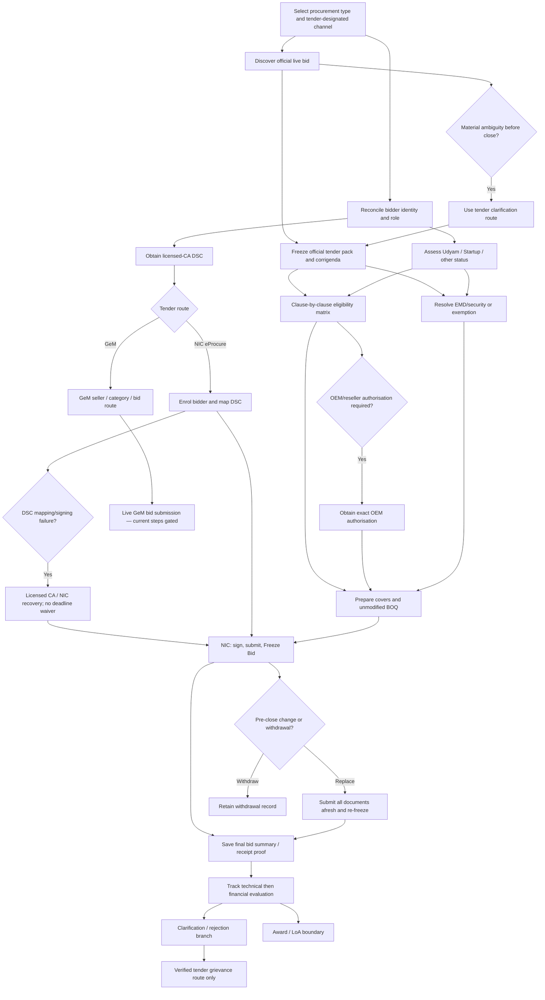

# Submit and freeze a portal-received Central bid

Verified on: **2026-08-28 (Asia/Kolkata)**  
Pack ID: `gon.central-procurement.first-bid.v1`  
Readiness: **Action Required**  
Machine-readable peer: `04-central-procurement-first-bid.json`

## Outcome and proof boundary

This pack helps a supplier identify the tender-designated Central procurement channel, reconcile its bidder identity, test bid-specific eligibility, submit a complete signed bid before the portal deadline, and retain a portal acknowledgment.

For NIC eProcure, the verified generic receipt path is:

1. enrol the bidder;
2. map the authorised e-token DSC;
3. read the current tender and every corrigendum;
4. attach the required files and the unmodified tender-supplied BOQ;
5. provide tender-specific security details/evidence;
6. digitally sign and click **Freeze Bid** before the portal server closes; and
7. save/print the bid summary.

The bid summary proves that the uploaded bid was **received and stored**. The official portal expressly says it does not certify correctness. Responsiveness, technical qualification, financial opening/ranking, award, Letter of Award, and contract are separate downstream states.

The current Goods Manual separately verifies that, before the submission deadline, a bidder may modify, substitute, or withdraw a bid through e-procurement; a replacement submission must contain the complete technical and financial document set afresh, and only the last bid is considered. Exact current NIC button sequences remain live-tender-specific because the detailed linked manuals are from 2018. After the deadline, bidder-initiated modification or withdrawal is not permitted.

## Scope and exclusions

The Central scope is GFR 2017 updated through 31 January 2026, the Department of Expenditure Goods Manual 2024 and Non-Consultancy Services Manual 2025, GeM, NIC eProcure/CPPP, Udyam, DPIIT Startup recognition, CCA-licensed Certifying Authorities, necessary banks, OEMs, portal helpdesks, and the tender-specific procuring entity.

This pack does not generalise state/local, PSU, defence, works, or consultancy rules. It does not promise MSE/Startup preference, turnover/experience relaxation, EMD exemption, fee waiver, local-content preference, technical qualification, award, or post-award performance. Any place-specific licence is a separate dependency only when the tender says so.

## Channel qualifier

GeM, CPPP publication, and NIC eProcure submission are related but not interchangeable:

| Question | Fail-closed treatment |
|---|---|
| Is the requirement goods, non-consultancy services, consultancy, works, or mixed? | Select the applicable manual and category before applying eligibility rules. |
| Is the item/service available and being procured on GeM? | Covered Central buyers must use GeM for available common-use goods/services. Use the live GeM bid terms. |
| Is a notice merely published on GeM-CPPP, or does it designate NIC eProcure/another portal for submission? | Publication does not prove the submission route. Follow the current tender and corrigenda. |
| Who is the bidder—OEM, manufacturer, authorised reseller/dealer, or service provider? | Role drives category, authorisation, and policy treatment. Unknown role blocks eligibility. |
| Does the bidder claim Udyam, DPIIT Startup, NSIC, or another status? | Verify the certificate and tender/rule applicability separately; status is not a universal benefit. |
| What does the tender require for qualification, security, documents, covers, formats, and deadline? | Unknown or inaccessible conditions are not passes. |

## Qualifying questions

| ID | Question | Blocking logic |
|---|---|---|
| `q04.procuring-entity` | Which Central entity issued the notice, and what are the official URL, tender ID, and reference? | No official match blocks preparation/submission. |
| `q04.procurement-type` | Goods, non-consultancy services, consultancy, works, or mixed? | Unknown/mixed classification requires the controlling tender/manual. |
| `q04.submission-channel` | GeM, NIC eProcure/CPPP, another compliant portal, or an express exception? | Do not enrol/submit until the tender designates the route. |
| `q04.supplier-role` | OEM/manufacturer, authorised reseller/dealer, service provider, integrator, or other? | Unproved role/brand authority blocks eligibility. |
| `q04.legal-identity` | Legal form, PAN, GSTIN status, bank name, address, and signatory basis? | Resolve identity/account mismatches before enrolment or signing. |
| `q04.category-qualification` | What specifications, licences, standards, experience, turnover, locations, and documents are required? | Do not invent thresholds, formats, or relaxations. |
| `q04.policy-status` | Is Udyam/Startup/other status current and expressly relevant to this tender? | No benefit without certificate, bidder-role/category fit, and tender/rule support. |
| `q04.dsc-role` | Does the authorised user have a valid licensed-CA DSC mapped to the correct account? | Expired/wrong-account/uncontrolled DSC blocks submission. |
| `q04.security` | Exact EMD/security/declaration/exemption amount, form, beneficiary, delivery, and validity? | No amount or exemption is assumed. |
| `q04.deadline-corrigenda` | What is the server close, and were all corrigenda checked immediately before submission? | Cached/snippet deadlines do not control. |
| `q04.state-local` | Does the tender expressly require a place-specific licence/facility/permit? | Create a bounded state/local gate only if the tender identifies one. |

## Dependency graph

## Task ledger

| Task | Status | Route / completion proof | Main fail-closed rule |
|---|---|---|---|
| `t04.select-channel` | Verified | Official notice; channel record | CPPP publication is not submission-channel proof. |
| `t04.establish-supplier` | Verified process; private facts required | Reconciled identity crosswalk | Public sources do not prove the bidder's private identity. |
| `t04.assess-policy-status` | Verified | Udyam/Startup verification plus tender clause matrix | No universal preference, exemption, or relaxation. Traders/resellers get particular scrutiny. |
| `t04.obtain-dsc` | Verified | CCA active list → licensed CA → issued DSC/token | CCA does not issue end-entity DSCs; fee/time are provider-specific. |
| `t04.enrol-gem` | Unavailable | Live GeM account/category proof | Current full live signup/category/bid steps were not publicly accessible. |
| `t04.enrol-cppp` | Verified | NIC enrolment and mapped-DSC evidence | Wrong identity or unmapped DSC blocks submission. |
| `t04.recover-dsc-signing` | Candidate | Helpdesk ticket plus correct live certificate mapping/signing readiness | A DSC mapped to one account cannot simply be remapped; no recovery SLA or archived UI sequence is assumed. |
| `t04.discover-bid` | Verified | Official Active Tenders/detail URL and snapshot | Captcha/index/secondary mirror is not a tender control set. |
| `t04.freeze-control-set` | Candidate for demo | NIT, schedules, BOQ, terms, all corrigenda | Missing annexure/BOQ/corrigendum blocks all bid-specific work. |
| `t04.seek-prebid-clarification` | Candidate case step; rule verified | Query receipt plus official response/corrigendum | Silence leaves a material ambiguity unresolved; only an official response/corrigendum changes the control set. |
| `t04.assess-bid-eligibility` | Candidate for demo | Clause-by-clause matrix | Unknown criteria are not passes; Startup relaxation requires express tender provision. |
| `t04.obtain-oem-authorisation` | Unavailable for demo | Authenticated tender-specific OEM letter/form | Generic dealership evidence is not assumed sufficient. |
| `t04.resolve-security` | Candidate for demo | Tender-accepted instrument/exemption and receipt | Rule-level 2–5%/45-day framework does not prove tender amount/form/exemption. |
| `t04.prepare-bid` | Candidate for demo | Final bid manifest | Do not replace/structurally edit supplied BOQ; open and virus-scan all files. |
| `t04.submit-freeze` | Verified generic NIC path | Successful message plus frozen bid summary | Unfrozen bid is incomplete/invalid; live server clock controls. |
| `t04.amend-withdraw-resubmit` | Candidate live UI; rule verified | Final replacement summary or withdrawal acknowledgment | Act only before close; replacement requires every document afresh and supersedes the earlier bid. |
| `t04.retain-ack` | Verified | Printed/saved bid summary | Receipt/storage proof is not correctness, qualification, or award. |
| `t04.track-evaluation` | Verified route | Official Tender Status/technical/financial/award records | Opening, qualification, price ranking, and award are distinct. |
| `t04.handle-clarification-rejection` | Verified boundary | Request/response receipt and rejection record | No price/substance change or post-close creation of qualification. |
| `t04.challenge-decision` | Candidate | Tender-adopted review/grievance receipt | The Goods Manual's five-/thirty-day model is suggested, not universal. |
| `t04.post-award` | Candidate case state | Award publication and LoA | Seller ID, originals, security, and contract are post-award and tender-specific. |

## Exact portal routes

### NIC eProcure/CPPP

- Discovery: [Active Tenders](https://eprocure.gov.in/eprocure/app?page=FrontEndLatestActiveTenders&service=page) → search Tender ID/title → captcha → official detail → download the complete current tender set during its published availability period.
- Pre-bid clarification: use the exact contact/electronic route and cutoff in the tender. For goods, when no cutoff is stated, the Goods Manual says to query before seven days of the bid deadline; responses should ordinarily be published without the bidder's identity at least five days before opening, with an extension when material changes require it.
- Enrolment/submission instructions: [Special Instructions to Contractors/Bidders](https://eprocure.gov.in/eprocure/app?page=HelpForContractors&service=page) → enrol in the bidder's name → login → map the bidder's or duly authorised person's e-token DSC → My Documents as applicable → exact tender → attach files/BOQ/security evidence → accept terms → sign → **Freeze Bid** → save/print summary.
- DSC incident: capture non-secret error/account/certificate/tender/timestamp evidence. The current help page says a DSC already mapped to one account cannot be remapped to another and can only be inactivated. Issuance/revocation defects go to the licensed CA; portal mapping/signing defects go to NIC helpdesk. A ticket is not a deadline waiver.
- Pre-close change: use only the live tender's permitted modify/withdraw/resubmit function. A replacement must contain all technical and financial documents afresh and be frozen before server close; retain the final replacement summary or withdrawal acknowledgment and mark earlier summaries superseded.
- Tracking: [Tender Status](https://eprocure.gov.in/eprocure/app?page=WebTenderStatusLists&service=page) → Search Criteria III → exact Tender ID → captcha. Check [Cancelled/Retendered Tenders](https://eprocure.gov.in/eprocure/app?page=WebCancelledTenderLists&service=page) separately by status/tender ID/keyword plus captcha, as well as Corrigendum and Bid Awards.
- Technical escalation: 0120-4001002, 0120-4001005, 0120-4493395; `support-eproc@nic.in`. Published-tender issues go to the respective Tender Inviting Authority; policy email is `cppp-doe@nic.in`.

The [Bidder Manual Kit](https://eprocure.gov.in/eprocure/app?page=BiddersManualKit&service=page) is a current index, but most core registration/cover/withdrawal/resubmission/clarification/BOQ manuals it links are dated 28 April 2018. They are `Stale` for volatile screen detail; use the current help page, live account/tender, and helpdesk.

### GeM

- The current [GeM Seller Journey](https://elearning.gem.gov.in/course/index.php?categoryid=2) separates Registration & Account Management, Catalogue Management, Bid and RA Participation, and Order Fulfillment. Support is `helpdesk-gem@gov.in`.
- A September 2024 [official GeM overview](https://assets-bg.gem.gov.in/resources/upload/shared_doc/gem-overview-ppt-2-september-2024-1_1725964078.pdf) described OEM/reseller category quadrants, mandatory catalogue certifications/licences/test reports, and bid/catalogue/order incident concepts. Those facts are marked `Stale`: they narrow what must be rechecked but do not establish current seller/category eligibility or current incident steps.
- The transactional login returned HTTP 403 to this research client. Complete current signup, account roles, category/OEM qualification, GTC/STC/ATC, acknowledgment, tracking, and incident-management steps remain `Unavailable` until captured from the live exact bid or GeM helpdesk.
- If a tender is actually on GeM, stop the NIC branch and use the live GeM transaction. NIC's **Freeze Bid** wording is not transplanted into GeM.

### Status and credential portals

- [Udyam](https://www.udyamregistration.gov.in/): registration is free, paperless, online and self-declared; the certificate has a permanent number and dynamic QR and needs no renewal. It proves registration/classification, not tender benefit.
- [DPIIT Startup recognition](https://www.startupindia.gov.in/content/sih/en/startupgov/startup_recognition_page.html): apply through NSWS; recognition application has no fee. Procurement relaxation remains tender-specific.
- [CCA active CA services](https://cca.gov.in/CAServicesPublic.html): select a current licensed CA for the required DSC/token. [CCA FAQ](https://cca.gov.in/faq.html) confirms CCA does not issue end-entity DSCs.

### Bid-security and preference gates

The Goods Manual's ordinary security framework is 2–5% of estimated value with validity normally 45 days beyond final bid validity. It lists insurance surety bond, demand draft, banker's cheque, bank guarantee including e-BG, and acceptable online payment; a Bid Security Declaration requires competent-authority approval and stated consequences. This is a rule-level menu, not the demo bid's amount or accepted form.

The manual records bid-security exemptions for MSEs and DPIIT-recognised Startups upon certified valid registration, plus selected competent-authority-approved cases. The navigator still requires the current certificate, bidder role/activity, registration trade-group/monetary scope where applicable, express tender implementation, and live acceptance. It does not turn Udyam/DPIIT status into a universal exemption, and the MSE purchase-preference exclusion for traders/resellers remains a separate rule.

## Required evidence and completion proofs

Before bid approval, reconcile:

- official tender ID/URL and full control set;
- bidder legal form, PAN, GSTIN applicability, address, bank name, and authorised signatory;
- OEM/manufacturer/reseller/service-provider role;
- current Udyam/DPIIT/other certificate only if relied upon;
- valid licensed-CA DSC under the authorised user's control and correct portal mapping;
- clause-specific category, licence, specification, experience, turnover, and past-performance proof;
- exact OEM authorisation where required;
- tender-specific EMD/security/declaration/exemption and bank instrument/delivery receipt;
- any pre-bid query receipt and official response/corrigendum;
- any non-secret DSC incident/helpdesk record and restored live mapping result;
- tender-supplied BOQ, technical/commercial files, final upload manifest, and all corrigenda.

Key proof IDs are `proof.channel-record`, `proof.identity-reconciliation`, `proof.policy-assessment`, `proof.dsc-possession`, `proof.dsc-recovery`, `proof.cppp-account-dsc`, `proof.prebid-query-record`, `proof.tender-snapshot`, `proof.eligibility-matrix`, `proof.oem-authorisation`, `proof.security-compliance`, `proof.final-bid-manifest`, `proof.frozen-bid-summary`, and, when a pre-close change occurs, `proof.preclose-action`.

Credentials, token PINs, passwords, and cryptographic secrets are never stored in the pack. Financial, personal, and confidential-commercial artifacts need access controls.

## Evaluation, clarification, rejection, and challenge

The current Goods Manual requires evaluation against the criteria already in the bidding document. In a two-envelope bid, only technically responsive/qualified bidders proceed to financial evaluation. A procuring-entity clarification cannot change price or substance; shortfall evidence may prove only a historical fact that existed before closing. A new qualifying supply order created after close cannot cure ineligibility.

For a rejection:

1. authenticate the portal/entity decision;
2. map each reason to the current tender clause, the submitted artifact, and the portal summary;
3. preserve the chronology;
4. request only the review/debriefing route actually adopted by the tender/entity; and
5. do not attempt informal influence.

The Goods Manual says the tender document should include the applicable bidder-grievance procedure. It also describes a suggested five-day pre-award review request and thirty-day post-award grievance period. This pack marks those periods `Candidate` because they are not presented as universally binding without tender adoption or another controlling instrument; the actual tender must supply the authority, channel, fee, deadline, and effect.

## Bounded demo scenario

**Persona:** InkBridge Supplies, a small Dharwad proprietorship and authorised reseller of printer ink/toner cartridges. It privately assumes consistent PAN/GSTIN/bank/signatory data, a current Udyam micro certificate, and a valid proprietor-controlled licensed-CA DSC. Because it is acting as a trader/reseller, it claims no MSE purchase preference or security exemption merely from Udyam.

**Identifiable opportunity (scenario assumptions only):** the opportunity labelled “Empanelment of OEM or Authorized Suppliers for Supply of Printer ink and toner Cartridges of different Brands of Printers or MFP or FAX machines for FY 2026 27”, associated during discovery with IIT Dharwad, reference `IITDH/MMD/RC/2026-27/01`, tender ID `2026_IITDW_922458_1`.

The [official NIC eProcure detail URL](https://eprocure.gov.in/eprocure/app?page=FrontEndViewTender&service=page&sp=Stu0N%2FfkK74COa9VFoq3KwQ%3D%3D) timed out on 2026-08-28. Search snippets and secondary tender mirrors were not admitted as evidence. Therefore even the title, issuer, identifier, and route above must be re-proved from the official page/NIT.

The currently admissible generic route is `t04.select-channel` → `t04.establish-supplier` → `t04.assess-policy-status` → `t04.obtain-dsc` → `t04.enrol-cppp` → `t04.discover-bid`. The scenario then stops before `t04.freeze-control-set`.

### Demo action-required gates

1. Retrieve the official detail, NIT, schedules, BOQ, terms, and all corrigenda; re-prove tender ID, issuer, channel, and server close.
2. Populate exact turnover, experience, licences, specifications, documents, cover structure, file formats, and evaluation method.
3. Obtain each required OEM/brand authorisation in the official form/scope; do not use a generic dealership letter by assumption.
4. Verify fee, EMD/security/declaration, exemption, amount, form, beneficiary, validity, and delivery. No zero-EMD or reseller-Udyam benefit is asserted.
5. If the route is GeM, stop the NIC branch and resolve the live GeM gaps.
6. Do not declare completion until the correct portal confirms submission/freeze and produces its system acknowledgment.

Expected portal-receipt proof for this first-bid attempt is `proof.frozen-bid-summary` after all upstream proof IDs pass. It proves receipt/storage only. No bid has been submitted, and the demo is not represented as correct, responsive, valid, qualified, ranked, empanelled, or awarded.

## Atomic claims

| Claim ID | Status | Atomic proposition | Exact official locator |
|---|---|---|---|
| `cl.gfr-gem` | Verified | Covered Central buyers must procure available common-use goods/services through GeM. | GFR Rule 149, pp.33–35 |
| `cl.gfr-publish` | Verified | Covered Central entities publish enquiries, corrigenda, and awards on GeM-CPPP. | GFR Rule 159, p.36 |
| `cl.gfr-eproc` | Verified | Covered Central bids are received through compliant e-procurement portals subject to bounded exceptions. | GFR Rule 160, pp.36–37; Goods §§1.10.2–1.10.3; NCS §§4.6.1–4.6.3 |
| `cl.ncs-channel` | Verified | Available non-consultancy services use GeM; otherwise the tender-designated e-procurement route governs. | NCS §§4.6.1–4.6.3, pp.100–102 |
| `cl.tender-self-contained` | Verified | Tender states eligibility, qualification, submission/opening, and evaluation. | GFR Rule 173(ii), pp.42–43 |
| `cl.tender-download-route` | Verified | Complete tender documents are available on official routes for download during the stated availability period. | Goods §§4.2, 5.2.1, pp.101–102, 148 |
| `cl.prebid-clarification` | Verified | Written/electronic pre-bid clarification has a tender cutoff or Goods Manual default; official response/corrigendum controls. | Goods §5.2.4, p.150 |
| `cl.preclose-resubmit-withdraw` | Verified | Before close, a bid may be modified/replaced/withdrawn; replacement is complete afresh and only the last bid counts. | Goods §5.2.5, pp.150–151 |
| `cl.eproc-bidder-dsc-role` | Verified | Account is in bidder name; DSC holder is bidder or duly authorised person. | Goods Appendix 3 §3(c), pp.381–382 |
| `cl.bid-security-forms-bsd` | Verified | Goods Manual lists accepted security-form types and permits a declaration only through a competent-authority gate. | Goods §6.1.1(ii)–(iii), pp.158–159 |
| `cl.bid-security-exemption-evidence` | Verified | Manual exemptions remain conditional on valid certified status, scope, authority, and tender implementation. | Goods §6.1.1(v), pp.158–159 |
| `cl.tender-grievance-clause` | Verified | Tender should state its applicable bidder-grievance/redressal procedure. | Goods §5.1.3, pp.142–144 |
| `cl.startup-relaxation` | Verified | Startup experience/turnover relaxation is optional and tender-specific. | GFR Rule 173(i); NCS §2.8.2 p.48 |
| `cl.gfr-bid-security` | Verified | Ordinary Rule 170 security framework is 2–5% and normally 45 days beyond bid validity. | GFR Rule 170; Goods §6.1.1 |
| `cl.mse-trader-exclusion` | Verified | Traders/distributors/sole agents are excluded from the Goods Manual's MSE purchase preference. | Goods §1.11.2, pp.40–42 |
| `cl.contract-bidder-name` | Verified | Contract is placed only in the successful bidder's name. | Goods §7.7, pp.201–203 |
| `cl.dsc-ca` | Verified | End-entity DSC comes from a licensed CA, not CCA. | CCA active-services table; CCA DSC FAQ |
| `cl.gem-learning-path` | Verified | Current GeM Seller Journey has account, catalogue, bid/RA, and fulfilment stages. | GeM LMS Seller Journey items 01–04 |
| `cl.gem-current-steps-unavailable` | Unavailable | Complete current GeM transaction/acknowledgment/incident steps were inaccessible. | LMS login boundary; transactional login HTTP 403 |
| `cl.gem-2024-category-architecture-stale` | Stale | A 2024 GeM overview described OEM/reseller category quadrants and catalogue compliance uploads. | GeM Overview, 2-Sep-2024 |
| `cl.gem-2024-incident-architecture-stale` | Stale | A 2024 GeM overview described bid/catalogue/order incident concepts. | GeM Overview, 2-Sep-2024 |
| `cl.cppp-enrol-dsc` | Verified | NIC bidders enrol, log in, and map e-token DSC. | CPPP Special Instructions 1–4 |
| `cl.cppp-dsc-remap-boundary` | Verified | A DSC mapped to one NIC account cannot simply be remapped to another and can only be inactivated. | CPPP Special Instruction 4 |
| `cl.cppp-helpdesk` | Verified | Technical issues go to NIC helpdesk; tender-content issues go to TIA. | CPPP Contact Us |
| `cl.cppp-active-search` | Verified | Active Tenders searches tender ID/title with captcha. | CPPP Active Tenders search form |
| `cl.cppp-status-search` | Verified | Tender Status supports exact tender ID with captcha. | CPPP Tender Status Criteria III |
| `cl.cppp-cancelled-search` | Verified | Cancelled/Retendered Tenders supports status/tender-ID/keyword search with captcha. | CPPP Cancelled/Retendered search form |
| `cl.cppp-read-tender` | Verified | Bidders must read tender schedules and submit required documents. | CPPP instruction 6 |
| `cl.cppp-boq` | Verified | Supplied BOQ must not be modified/replaced. | CPPP instruction 7 |
| `cl.cppp-corrigenda` | Verified | Clarifications/corrigenda must be checked before submission. | CPPP instruction 8; GFR 173(iii) |
| `cl.cppp-emd-tender` | Verified | Arrange EMD as tender says; match scanned/physical details where applicable. | CPPP instructions 10, 15 |
| `cl.cppp-freeze` | Verified | Unfrozen NIC bid is incomplete/invalid. | CPPP instruction 14 |
| `cl.cppp-success-message` | Verified | Freezing yields successful update and bid summary. | CPPP instruction 18 |
| `cl.cppp-summary-proof` | Verified | Save/print bid summary as acknowledgment. | CPPP instruction 19 |
| `cl.cppp-receipt-boundary` | Verified | Successful submission means received/stored, not certified correct. | CPPP instruction 20 |
| `cl.cppp-server-clock` | Verified | Displayed server IST controls bid actions. | CPPP instructions 22, 25; NCS p.117 |
| `cl.cppp-virus` | Verified | Virus-unopenable documents are liable to rejection. | CPPP instruction 21 |
| `cl.evaluation-existing-conditions` | Verified | Evaluation uses published criteria and eligibility/responsiveness before price comparison. | GFR 173(xiii)–(xvi); Goods §§7.3.5–7.5 |
| `cl.clarification-limits` | Verified | Clarification cannot change price/substance or create post-close qualification. | Goods §7.3.5, pp.184–185 |
| `cl.two-envelope-evaluation` | Verified | Financial bids open only for technically responsive/qualified bidders in two-envelope procurement. | Goods §§7.4–7.5, pp.185–187 |
| `cl.award-publication` | Verified | Award information is published on the official procurement route. | GFR 159, 173(xvii); Goods §7.7.2 |
| `cl.suggested-review` | Candidate | Five-/thirty-day grievance periods are a suggested Goods Manual mechanism. | Goods §3.4, pp.82–84 |
| `cl.no-influence` | Verified | Improper bidder contact/influence during evaluation can lead to rejection. | Goods §7.3.5 |
| `cl.loa-boundary` | Verified | Successful bidder receives LoA; originals may be verified before contract. | Goods §7.7 |
| `cl.gem-id-before-loa` | Verified | Outside-GeM successful goods bidder obtains GeM seller ID before LoA/contract. | Goods §7.7 |
| `cl.udyam-process` | Verified | Udyam is free/online/paperless with permanent number, QR, and no renewal. | Udyam “Important to Know” / “Must Follow” |
| `cl.startup-recognition` | Verified | Eligible entities apply through NSWS; DPIIT recognition application has no fee. | Startup India recognition/application/fee sections, updated 20-Aug-2026 |
| `cl.cppp-core-manuals-stale` | Stale | Most detailed core NIC bidder manuals on the current kit date to 2018. | Bidder Manual Kit items 1, 3–10 |
| `cl.demo-tender-unavailable` | Unavailable | Demo official tender control set and bid-specific facts were not retrievable. | Official detail URL timed out on 2026-08-28 |
| `cl.demo-oem-form-unavailable` | Unavailable | Demo OEM authorisation form/scope is unknown. | Official NIT unavailable |
| `cl.demo-security-unavailable` | Unavailable | Demo EMD/security/exemption terms are unknown. | Official NIT unavailable |

## Official sources

| Source | Tier | Current locator / access |
|---|---|---|
| [GFR updated 31-Jan-2026](https://doe.gov.in/files/whats_new_documents/GFRupdatedupto31012026.pdf) | T1_LAW | Rules 149, 159, 160, 170, 173; accessible |
| [Goods Manual 2024](https://doe.gov.in/files/circulars_document/Manual_Goods_2024.pdf) | T1_AUTHORITY | §§1.10.2–1.10.3, 1.11.2, 3.4, 4.2, 5.1.3, 5.2.1, 5.2.4–5.2.5, 6.1.1, 7.3.5–7.5, 7.7, Appendix 3 §3(c); accessible |
| [Non-Consultancy Services Manual 2025](https://doe.gov.in/files/circulars_document/MfPoNCS_2025.pdf) | T1_AUTHORITY | scope, §2.8.2, §§4.6.1–4.6.3, p.117, p.156; accessible |
| [CPPP bidder help](https://eprocure.gov.in/eprocure/app?page=HelpForContractors&service=page) | T1_PORTAL | instructions 1–25; portal version 1.09.24 dated 16-Jul-2026 |
| [CPPP Contact Us](https://eprocure.gov.in/eprocure/app?page=FrontEndContactUs&service=page) | T1_PORTAL | helpdesk/TIA/policy contacts; accessible |
| [CPPP Active Tenders](https://eprocure.gov.in/eprocure/app?page=FrontEndLatestActiveTenders&service=page) | T1_PORTAL | captcha search; accessible |
| [CPPP Tender Status](https://eprocure.gov.in/eprocure/app?page=WebTenderStatusLists&service=page) | T1_PORTAL | criteria I–III; accessible |
| [CPPP Cancelled/Retendered](https://eprocure.gov.in/eprocure/app?page=WebCancelledTenderLists&service=page) | T1_PORTAL | status/tender-ID/keyword captcha search; accessible |
| [CPPP Bidder Manual Kit](https://eprocure.gov.in/eprocure/app?page=BiddersManualKit&service=page) | T1_PORTAL | current index; most core manuals stale (2018) |
| [GeM Seller LMS](https://elearning.gem.gov.in/course/index.php?categoryid=2) | T1_PORTAL | journey index accessible; course content login-gated |
| [GeM Overview, 2-Sep-2024](https://assets-bg.gem.gov.in/resources/upload/shared_doc/gem-overview-ppt-2-september-2024-1_1725964078.pdf) | T1_PORTAL | accessible but cited only as Stale category/incident architecture |
| [GeM login](https://ui.gem.gov.in/login) | T1_PORTAL | blocked (HTTP 403) |
| [Udyam](https://www.udyamregistration.gov.in/) | T1_PORTAL | current portal, live facts dated 27-Aug-2026 |
| [Startup recognition](https://www.startupindia.gov.in/content/sih/en/startupgov/startup_recognition_page.html) | T1_AUTHORITY | updated 20-Aug-2026; accessible |
| [CCA active CA services](https://cca.gov.in/CAServicesPublic.html) | T1_AUTHORITY | active DSC providers/contact list; accessible |
| [CCA FAQ](https://cca.gov.in/faq.html) | T1_AUTHORITY | DSC issuer/how-to questions; accessible |
| [Demo IIT Dharwad detail](https://eprocure.gov.in/eprocure/app?page=FrontEndViewTender&service=page&sp=Stu0N%2FfkK74COa9VFoq3KwQ%3D%3D) | T1_PORTAL | unavailable; HTTP 400 timeout |

## Coverage gaps (8)

| Gap | Status | Safe treatment / resolution |
|---|---|---|
| Current GeM signup, roles, category, bid acknowledgment | Unavailable | A 2024 official category/OEM-reseller architecture was found but is Stale; use exact live seller/bid and GeM helpdesk. |
| Current GeM GTC/STC/ATC and incident process | Unavailable | A 2024 official incident architecture was found but is Stale; download current terms from the authenticated bid or obtain an authoritative helpdesk response. |
| Detailed NIC cover/DSC-recovery/resubmission/withdrawal UI | Stale | Rule-level actions and remapping boundary are now verified; use the live portal/helpdesk for current screen mechanics and SLA. |
| Demo official NIT/BOQ/corrigenda/metadata | Unavailable | Retrieve the official pack or matching signed TIA copy; do not submit meanwhile. |
| Demo OEM qualification/form | Unavailable | Extract exact clause/form and obtain matching authenticated OEM authority. |
| Demo fee/EMD/security/exemption | Unavailable | No zero-EMD or automatic exemption; verify official clause/forms. |
| Demo turnover/experience/licence/cover/evaluation | Unavailable | Populate only from exact official clauses/pages. |
| Demo future submission/evaluation/rejection/award | Unavailable | Treat all expected proofs as prospective; track only official system/entity records. |

There were no admitted authoritative conflicts. The unresolved records are `Candidate`, `Stale`, or `Unavailable` gates rather than competing verified propositions.
