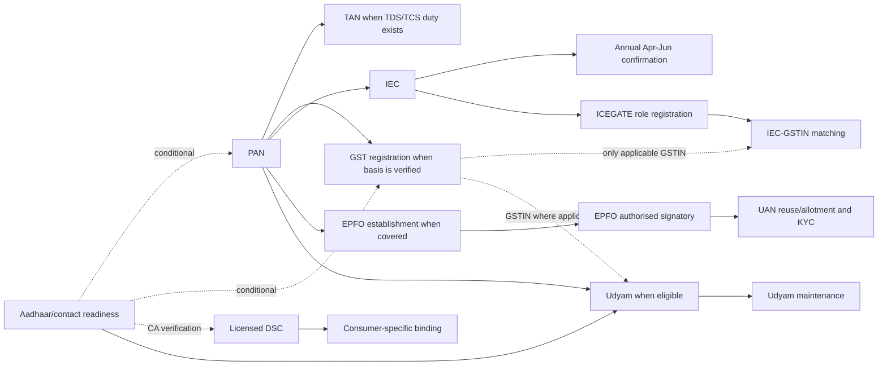

# Reusable central-government foundations

Verification date: **2026-08-28 (Asia/Kolkata)**  
Pack ID: `in.central.reusable-foundations.v1`  
Readiness: **Action Required**

## Outcome and boundary

This pack is a reusable dependency library. It establishes only the national identifiers, portal identities and signature bindings that a downstream journey has already shown to be applicable. It does **not** decide GST liability, TDS/TCS liability, EPFO coverage, MSME eligibility, customs treatment, tender eligibility, or any state/local registration.

Included modules are Aadhaar/contact readiness; PAN; conditional TAN; GST registration account; CCA-licensed DSC/eSign boundary; IEC; ICEGATE role registration, IEC-GSTIN mapping and DSC linkage; EPFO establishment/signatory/member-UAN foundations; and conditional Udyam registration. Transactional returns, declarations, payroll filings, bids, MCA forms and GeM transactions are excluded. Bank onboarding is also excluded: an account/proof is a regulated-private input, not a universal government workflow.

Only a `Verified` claim may drive a happy path. `Candidate`, `Conflict`, `Stale` and `Unavailable` records below are visible gates. A public source proves the public rule, never the applicant's private eligibility, identity, approval or account state.

## Reuse and consumer hand-offs

| Foundation | Activate only when | Typical consuming journey packs | Handoff proof |
|---|---|---|---|
| Aadhaar/contact readiness | A selected portal uses Aadhaar OTP, eKYC, eSign or face authentication | startup/tax, GST, IEC, EPFO member, Udyam | official verification/update reference; never an OTP |
| PAN | The applicant must obtain, correct or prove an active PAN | startup/tax, GST, trade, employment, Udyam, procurement identity | allotted PAN plus successful official status check |
| TAN | A tax review confirms deduction/collection duties | hiring/payroll/TDS-TCS | allotted/verified TAN, not PAN |
| GST registration | A separate GST journey supplies a verified basis, State/UT and taxpayer type | taxable-business setup, import/export GST linkage, seller identity | REG-06/GSTIN, not TRN/ARN alone |
| DSC/eSign | The exact consuming transaction proves the signature method/profile | MCA, ICEGATE, EPFO, CPPP, conditional GST/GeM/DGFT | valid certificate plus separate portal-binding confirmation |
| IEC and annual confirmation | Goods import/export, or qualifying service/technology FTP benefit, with no exemption | import/export readiness | IEC certificate/profile; annual update acknowledgement |
| ICEGATE role/linkage | A customs service needs an approved external-user role | import/export/customs | approved user ID; IEC-GSTIN mapping proof where applicable; DSC association is a separate gated proof |
| EPFO establishment/signatory/UAN | Coverage and route are separately established | hire/payroll/employer compliance | establishment code, approved signatory, reused/new UAN and KYC state |
| Udyam | A separate assessment confirms MSME eligibility and registration is wanted | MSME benefits, procurement/seller identity | verifiable Udyam certificate/QR |

The consumer owns the liability/eligibility decision and any transaction after the handoff. The foundation owns identity consistency, route selection, correction, status tracking and reusable proof.

Exact cross-pack handoffs now replace the former unresolved consumer-contract gap:

| Consuming pack | Consumer task IDs | Reused foundation task | Duplicate local claims to map, not re-research |
|---|---|---|---|
| 01 import regulated product | `imp.t02`, `imp.t03`, `imp.t14` | `t.iec.obtain`, `t.icegate.register`, `t.gst.register` | `clm.iec-required`, `clm.iec-route`, `clm.iec-proof`, `clm.icegate-registration`, `clm.gst-route` |
| 02 first goods export | `task.iec`, `task.icegate-registration` | `t.iec.obtain`, `t.icegate.register` | `claim.iec-portal`, `claim.iec-fee`, `claim.icegate-registration` |
| 03 incorporate and hire | `t07.outputs`, `t17.tds-report`, `t18.epf`, `t20.gst` | `t.pan.obtain-maintain` / conditional `t.tan.obtain-maintain`, `t.epfo.establishment`, `t.gst.register` | `c.spice-outputs`, `c.tan`, `c.social-registration`, `c.epf-threshold`, `c.gst-registration`; `c.saved-schemes` is Stale and aligns with `cl.epfo.saved-schemes` |
| 04 first central procurement bid | `t04.obtain-dsc`, `t04.enrol-cppp`, `t04.assess-policy-status` | `t.dsc.obtain`, `t.dsc.bind-consumer`, conditional `t.udyam.register` | `cl.dsc-ca`, `cl.cppp-enrol-dsc`, `cl.udyam-process` |

The downstream pack keeps its case-specific qualifier and transactional steps. These IDs map the shared prerequisite and proof only; they do not make GST, TAN, EPFO, DSC or Udyam universal.

## Qualifying questions

| ID | Question | Blocking rule |
|---|---|---|
| `q.identity.aadhaar-ready` | Is Aadhaar valid and is its registered mobile accessible? | Unknown/No blocks only Aadhaar-dependent branches; mobile correction goes to a UIDAI centre. |
| `q.pan.applicant-type` | Is there an existing PAN, and what is the applicant category/residency? | Existing PAN blocks a fresh/Instant e-PAN; category selects Forms 93-96 or CR-01/CR-02. |
| `q.tan.deductor-collector` | Has a tax review confirmed a TDS/TCS duty? | Unknown/No keeps TAN off. |
| `q.gst.registration-basis` | What verified GST registration basis, State/UT and taxpayer type applies? | No verified basis means no REG-01. |
| `q.gst.constitution-signature` | What constitution and live REG-01 signature method apply? | The live form controls; the published DSC/EVC inconsistency is not resolved by assumption. |
| `q.trade.iec-needed` | Is this goods trade, qualifying services/technology seeking FTP benefits, or an exemption? | Exemption/unknown prevents an IEC happy path until resolved. |
| `q.icegate.role` | Which ICEGATE external-user role and parent/child position applies? | Unknown role blocks registration. |
| `q.dsc.consumer` | Which portal, transaction, signing/encryption profile and authorised human signer require a DSC? | No verified consumer requirement means do not procure/bind a DSC. |
| `q.epfo.coverage-route` | Does the establishment employ 20+ employees, is it already registered, or does a separate below-threshold basis apply? | From 21 November 2025, every 20+ establishment meets the ordinary Chapter III threshold regardless of industry schedule. Below 20 needs a current notified/voluntary basis. Existing registration blocks duplication; unclear legacy portal labels gate submission, not coverage. |
| `q.epfo.member-state` | Does the joining employee already have a UAN and what KYC is approved? | Search/reuse first; duplicate-UAN risk is a stop gate. |
| `q.udyam.eligibility` | Has MSME eligibility been separately confirmed, and does the enterprise already have Udyam? | No assessment or existing registration blocks a duplicate new application. |

## Modular dependency graph

Dashed edges are conditional. An IEC holder is only one ICEGATE role; Customs Brokers, custodians, logistics operators, PGAs, non-IEC/UIN and SEZ users require their own verified role evidence.

## Task nodes and exception branches

### Identity, PAN and TAN

| Task | Class / status | Exact route and verified happy path | Proof, correction, tracking and escalation |
|---|---|---|---|
| `t.identity.aadhaar-contact` | `FOUNDATION_IDENTITY` / Verified | [My Aadhaar](https://myaadhaar.uidai.gov.in/) > Aadhaar Services > Verify Aadhaar or Verify Email/Mobile. If the mobile is wrong/unavailable, locate an Aadhaar Enrolment/Update Centre; it is not an online-only update. | Keep EID/URN/SRN, not OTPs. Track/status or use UIDAI 1947, web grievance and the instructed Regional Office. An Aadhaar copy is not proof that authentication works. |
| `t.pan.obtain-maintain` | `FOUNDATION_IDENTITY` / Verified | First check for an existing PAN. From 1 April 2026 select Form 93/94/95/96 by applicant category or CR-01/CR-02 for correction through the [Income Tax PAN page](https://www.incometaxindia.gov.in/en/pan) and authorised UTIITSL/Protean route. Eligible no-PAN individuals may use [Instant e-PAN](https://www.incometax.gov.in/iec/foportal/help/all-topics/e-filing-services/instant-e-pan/instant-UM?mobile-app=1). | General fee is mode/address/card-choice dependent; live table controls. Instant e-PAN is free. Track by provider acknowledgement, then use [Verify PAN](https://eportal.incometax.gov.in/iec/foservices/#/pre-login/verifyYourPAN). A deficient final application requires a fresh correct application; later data changes use correction. |
| `t.tan.obtain-maintain` | `REGISTRATION_ENROLMENT` / Verified, conditional | Only after a TDS/TCS duty is confirmed: use Form 134 for government or 135 for non-government from 1 April 2026 through [Protean TAN](https://www.tinpan.proteantech.in/services/tan/tan-downloads), online or TIN-FC. | ₹77 including GST; keep 14-digit acknowledgement and track after three days. Check allotted data through [Know TAN](https://www.incometax.gov.in/iec/foportal/help/all-topics/e-filing-services/know-tan-details). Use correction, not a duplicate TAN; PAN is not a substitute. Escalate Protean application issues at TIN Call Centre 020-27218080. |

### GST registration account

`t.gst.register` is `REGISTRATION_ENROLMENT` / Verified only after the consuming GST journey supplies the registration basis, State/UT and taxpayer type.

1. At [gst.gov.in](https://www.gst.gov.in/), use Services > Registration > New Registration. REG-01 Part A validates PAN, mobile, email and State/UT and returns a TRN.
2. Use the TRN for Part B: constitution, promoters, authorised signatory, places, goods/services and the live upload set.
3. Follow the portal-selected Aadhaar branch. The official current FAQ permits risk routing to OTP or GST Suvidha Kendra biometric/document verification; selecting No also requires GSK photo/document verification, subject to the stated exclusions and 15-day window.
4. File using only the signature option offered to that applicant in the live form. Official hosted materials conflict on whether specified companies/LLPs must use DSC or EVC is enabled for all taxpayers.
5. Keep REG-02/ARN. Answer REG-03 electronically in REG-04 within seven working days. No/unsatisfactory reply may lead to REG-05 rejection.
6. Completion is downloadable REG-06/GSTIN, not TRN or ARN. Core/non-core amendment routes maintain data; a constitution change that changes PAN requires a fresh REG-01.

Track at Services > Registration > Track Application Status. If processing remains pending beyond the portal's stated seven-working-day checkpoint, use Services > User Services > Contact for the jurisdictional officer. For reproducible portal errors, raise a ticket with screenshot and timestamp; retain ARN/notices and never disclose OTPs or credentials.

### DSC, eSign and consumer boundaries

`t.dsc.obtain` is `REGULATED_PRIVATE_DEPENDENCY` / Verified. Procure only after a live consumer establishes the profile. Select a currently active licensed CA from the [CCA list](https://www.cca.gov.in/CAServicesPublic.html). CCA's current Class 3 verification options include Aadhaar biometric, paper plus physical/video presence, or Aadhaar OTP plus video; the private key is stored in a FIPS 140-2 level 2 hardware cryptographic device. Retail price remains **Candidate** because it varies by CA/product. Validity control is Verified but certificate-specific: read the certificate's own validity period and current revocation state rather than inventing one duration.

CCA [eSign](https://cca.gov.in/eSign.html) is different: an application-integrated eKYC-authenticated, one-time signature whose HSM key is destroyed after use, with no physical token. It cannot be modelled as a persistent DSC. For retained signatures, preserve the public signer certificate, issuer chain and relevant revocation-status evidence needed for validation after expiry; validity is assessed at signing time. On compromise, notify the CA and request revocation without delay. When an organisational signer leaves, revoke and destroy keys. Never retain a token PIN/private key.

`t.dsc.bind-consumer` is `FOUNDATION_IDENTITY` / **Conflict** because signature method is portal/transaction-specific:

| Consumer | Verified boundary / route | Safe treatment |
|---|---|---|
| MCA V3 | Business User; MCA Services > FO LLP Services > Associate DSC before a signer files ([official FAQ](https://www.mca.gov.in/content/dam/mca/pdf/DSC-Association-FAQs-20230315.pdf)). | FAQ is dated; confirm current V3 utility/profile live. |
| ICEGATE | The current public catalog exposes Register DSC, Update DSC and Sign Using DSC as post-login services, but the accepted profile, role-specific necessity, utility and completion state remain login-gated. | Candidate: keep binding off the happy path. A valid DSC and a successful IEC-GSTIN match prove neither ICEGATE DSC association nor filing authority. |
| EPFO | Employer Interface > Establishment > DSC/e-Sign > Digital Signature Registration or eSign; approval is separate. | Generated request letter/attempt is not approval. |
| CPPP | [Online Bidder Enrollment](https://eprocure.gov.in/eprocure/app) then token/DSC enrolment; official user-organisation guidance states Class III signing and encryption for authorised users. | Tender-specific bidder requirements control. |
| GST | The accessible Welcome Kit says specified companies/LLPs require DSC. A 2021 compilation that claimed EVC for all taxpayers now returns 404; the current clarification manual exposes both buttons only “as applicable/eligible” and retains a DSC-only IRP/RP case. GST Register/Update DSC also requires the certificate name/PAN to match the selected authorised signatory. | Open conflict: the exact live transaction control and eligibility decide. Cached 2021 text cannot establish current universal EVC eligibility; resolve PAN/name mismatch before retrying. |
| GeM | Terms/manual show source-database validation and certificate-detail management, but current login is under controlled rollout. | Candidate: verify the current seller/transaction method live. |
| DGFT | IEC flow supports live portal signing route. | Do not import old certificate-class screenshots into a current rule. |

### IEC and ICEGATE

| Task | Class / status | Exact route and happy path | Proof, maintenance and failure branch |
|---|---|---|---|
| `t.iec.obtain` | `LICENCE_AUTHORISATION` / Verified | When [FTP 2023](https://content.dgft.gov.in/Website/dgftprod/61d61bc2-272e-4880-b96c-c8f685a3b244/Foreign%20Trade%20Policy%202023.pdf) makes IEC applicable: register as Importer/Exporter at [DGFT](https://www.dgft.gov.in/), then My Dashboard > IEC Profile Management > Apply for IEC. Supply active entity PAN, entity-name bank account, valid address and responsible/signatory data; use the live Aadhaar eSign/DSC option. | ₹500. Failed bank validation blocks/rejects; an in-progress result enters automatic review. Track under My Dashboard > Submitted Applications using lifecycle, payment, DSC/eSign, transmission, approved-letter and Respond To Deficiency views. Retain receipt and IEC certificate/QR/profile. Update/Modify corrects data; IEC alone does not authorise restricted goods or clear a shipment. |
| `t.iec.annual-confirm` | `PERIODIC_COMPLIANCE` / Verified | Each April-June use IEC Profile Management > Update/Modify IEC, even with no change. | Nil in-window; ₹200 after the stipulated period. Keep acknowledgement/profile. Non-update can deactivate IEC and update can reactivate that cause, but not unrelated suspension/cancellation/risk action. |
| `t.icegate.register` | `REGISTRATION_ENROLMENT` / Verified with dynamic-field gap | [ICEGATE](https://www.icegate.gov.in/services/registration-icegate) > Register Now or Services > Registration > Registration on ICEGATE; choose the exact role. IEC organisations distinguish parent IEC holder/authorised person and employee child users. PAN name and source-registered mobile/email must match; importer/exporter contacts match DGFT/GSTN as stated. | Completion is approved credentials, not reference number. Approval/rejection reason is emailed. Correct role, PAN/name, licence/authorisation or source mismatch; use ICEGATE Ticket Management/24x7 helpdesk 1800-3010-1000. Full role fields are post-login and remain Unavailable. |
| `t.icegate.map-gstin` | `FOUNDATION_IDENTITY` / Verified | Services > Registration > For Matching IEC GSTIN; enter IEC, applicable GSTIN and captcha. If ICEGATE says the GSTIN is not integrated, use Integrate GSTIN first and retry. | Retain the success message, which says to allow 24 hours for reflection, then re-check the profile/service. Correct DGFT/GSTN master data at source. This proof does not establish DSC association or customs-filing authority. |

### EPFO employer, signatory and member foundations

| Task | Class / status | Exact route and happy path | Proof, correction and escalation |
|---|---|---|---|
| `t.epfo.establishment` | `REGISTRATION_ENROLMENT` / Candidate for submission; substantive threshold Verified | First apply [Code on Social Security First Schedule Part I](https://labour.gov.in/sites/default/files/ss_code_gazette.pdf): Chapter III covers **every establishment with 20+ employees**, and the former scheduled-industry limit is removed. [G.S.R. 525(E)](https://egazette.gov.in/WriteReadData/2026/273957.pdf) is the current EPF Scheme and supersedes Scheme 1952 except prior acts/omissions. Search for an existing code. For an establishment not already registered, final [Social Security (Central) Rules, 2026](https://www.labour.gov.in/static/uploads/2026/05/49aa9b62c2125499c37399b90e969d67.pdf) rule 5 requires electronic common Form-I of the OSH Central Rules on [Shram Suvidha](https://registration.shramsuvidha.gov.in/), digitally or otherwise signed as the portal requires. | Rule 5 provides electronic Form-III within seven days of a complete application or auto-generation on deemed registration; changes are updated within 30 days. Wrong-information cancellation has a 30-day show-cause opportunity; complete closure cancellation is decided within 90 days after returns/dues/self-certification conditions. No current public 2026 Form-I implementation manual was found; Shram/EPFO pages still use legacy EPF Act/Scheme 1952 labels, so confirm the live Form-I transaction before submission. Portal lag never excludes a 20+ non-scheduled establishment. Validate through [EPFO Establishment Search](https://unifiedportal-emp.epfindia.gov.in/publicPortal/no-auth/misReport/home/loadEstSearchHome). |
| `t.epfo.signatory` | `FOUNDATION_IDENTITY` / Verified | Employer Interface > Establishment > DSC/e-Sign > Digital Signature Registration or eSign. The eSign route uses VID/basic details and can require a signed/uploaded request letter and approval. | Proof is approved signatory state. Resolve Aadhaar demographics, expired DSC, authority letter or office approval; replace/revoke when authority ends. |
| `t.epfo.member-uan` | `EMPLOYMENT_PAYROLL` / Verified | Search for/reuse existing UAN. Current web portal says direct allotment/activation is discontinued; use UMANG > EPFO Services > UAN Services Through Face Auth > UAN Allotment and Activation or UAN Activation with Aadhaar-linked mobile and Aadhaar Face RD. Then review/add PAN/bank/Aadhaar KYC in Member Portal. | UAN is persistent across jobs; duplicate risk stops the flow. Distinguish pending, employer digitally approved and UIDAI-verified KYC states. Correct Aadhaar-UAN/profile data before continuing; escalate via UMANG help, EPFO 14470/EPFiGMS or the concerned office. UAN activation does not prove KYC or contributions. |

### Conditional Udyam foundation

`t.udyam.register` is `REGISTRATION_ENROLMENT` / Verified only after a separate MSME assessment. Use only [udyamregistration.gov.in](https://udyamregistration.gov.in/UdyamRegistration.aspx): New Registration > Aadhaar verification > PAN verification > basic/address/unit/activity details. Registration is free, paperless and self-declared; Aadhaar, PAN and GSTIN where applicable are used. One enterprise must not make multiple registrations, though one record may contain multiple activities. Completion is the official certificate with dynamic QR, verified through Print/Verify.

`t.udyam.maintain` is `PERIODIC_COMPLIANCE` / Verified. Use [Udyami Login](https://udyamregistration.gov.in/Udyam_Login.aspx) to review/update editable data. PAN/GST-owned values are fetched from government source systems and must be corrected there. Udyam has no renewal, but downstream use still requires a current verified record. Escalation is through the official Udyam/Champions route.

## Actors, required inputs and completion proofs

Competent actors are UIDAI; Income Tax Department/CBDT; authorised Protean and UTIITSL; GST Common Portal/GSTN and proper officer; DGFT; ICEGATE/CBIC Systems; CCA and a licensed CA; MCA; CPPP/NIC; GeM; EPFO; Shram Suvidha/Ministry of Labour; Ministry of MSME; the applicant/employer/employee; and the applicant's regulated bank. Government and regulator roles establish public rules; users and regulated actors supply private identity, authorisation and financial facts.

| Module | Sensitive inputs (when applicable) | Completion proof and validation |
|---|---|---|
| Aadhaar | Aadhaar/VID, registered contact; OTP remains credential-secret | official valid/contact result or EID/URN/SRN; use UIDAI status |
| PAN/TAN | applicant category, identity/address/date evidence, responsible person, acknowledgement | PAN/allotment plus Verify PAN; TAN letter/details plus Know TAN/Protean status |
| GST | PAN, contacts, jurisdiction/type, constitution/place proofs, promoter/signatory/Aadhaar data | REG-02/ARN for tracking; REG-06/GSTIN for completion |
| DSC | human signer identity, organisation authorisation, consumer profile; token/PIN/private key never shared | CA-issued certificate metadata and live chain/status; separate consumer mapping |
| IEC | PAN, address, bank proof, contacts, signatory | IEC certificate/QR/profile and annual update acknowledgement |
| ICEGATE | PAN/IEC, source contacts, exact role licence/authorisation; applicable GSTIN for mapping; DSC only when separately required | approved user credentials; IEC-GSTIN mapping proof; separate conditional DSC confirmation |
| EPFO | common Form-I employer identity/address, PAN/unique identifier, establishment/activity and employee-count facts; signatory authority; employee Aadhaar/mobile/bank/PAN/employment data | electronic Form-III/auto-generated certificate plus establishment search record; approved signatory; UAN and separately shown KYC states |
| Udyam | prescribed person's Aadhaar, PAN, applicable GSTIN, enterprise/unit/activity data | Udyam number/certificate with verified dynamic QR |

Formats and validity periods are stated only where the cited official source does so. No universal DSC price/validity, bank-account format or portal processing time is invented.

## Atomic claim map

| Claim ID / status | Atomic proposition | Primary evidence |
|---|---|---|
| `cl.identity.verify` Verified | UIDAI exposes Aadhaar and registered mobile/email verification services. | [UIDAI services](https://uidai.gov.in/en/my-aadhaar/avail-aadhaar-services.html), headings “Verify Aadhaar” and “Verify Registered mobile or email id” |
| `cl.identity.mobile-update` Verified | Mobile-number update requires an Aadhaar centre, not online-only self-service. | [UIDAI update FAQ](https://www.uidai.gov.in/en/297-faqs/enrolment-update), “Where can I update my mobile number?” |
| `cl.identity.grievance` Verified | UIDAI grievance routes use EID/URN/SRN and include 1947, web and Regional Office channels. | [UIDAI grievance](https://www.uidai.gov.in/en/?Itemid=&id=57&view=article), grievance mechanism |
| `cl.pan.need` Verified | Persons/entities in the official filing/prescribed-transaction cases should obtain PAN. | [Income Tax PAN](https://www.incometaxindia.gov.in/en/pan), FAQ 2 |
| `cl.pan.forms-route` Verified | From 1 April 2026 Forms 93-96 apply by Indian/foreign and individual/non-individual category; CR-01/CR-02 are the corresponding correction forms. | [Income Tax PAN](https://www.incometaxindia.gov.in/en/pan), FAQ 4 |
| `cl.pan.route` Verified | General PAN new/correction applications use authorised UTIITSL/Protean online services or authorised PAN centres, with MCA/SEBI common forms only where applicable. | [Income Tax PAN](https://www.incometaxindia.gov.in/en/pan), FAQ 5; [Protean](https://tinpan.proteantech.in/services/pan/pan-index.html) |
| `cl.pan.track` Verified | Track a general PAN request on the selected provider using its acknowledgement/reference. | [Income Tax PAN](https://www.incometaxindia.gov.in/en/pan), FAQ 13; [Protean](https://tinpan.proteantech.in/services/pan/pan-index.html), Know Status |
| `cl.pan.fee` Verified | General PAN charges vary by submission mode, address and physical-card choice; use the current operator table, not one universal amount. | [Income Tax PAN](https://www.incometaxindia.gov.in/en/pan), FAQs 7-8/current fee tables |
| `cl.pan.instant` Verified | Eligible no-PAN individuals with Aadhaar-linked mobile and stated prerequisites can obtain free Instant e-PAN. | [Instant e-PAN manual](https://www.incometax.gov.in/iec/foportal/help/all-topics/e-filing-services/instant-e-pan/instant-UM?mobile-app=1), sections 1-3 and FAQs |
| `cl.pan.verify` Verified | Verify PAN Status is a pre-login OTP service returning PAN status. | [Verify PAN manual](https://www.incometax.gov.in/iec/foportal/help/how-to-verify-pan?mobile-app=1), sections 1-3 |
| `cl.pan.reject` Verified | A deficient final general PAN application is invalid/fresh; later changes use correction. | [Income Tax PAN](https://www.incometaxindia.gov.in/en/pan), FAQs 9-11, 16 |
| `cl.tan.need` Verified | Confirmed deductors/collectors need TAN; PAN cannot substitute. | [TAN 134/135 FAQs](https://www.incometaxindia.gov.in/documents/d/guest/form-134-135-faqs), FAQs 1-2 |
| `cl.tan.forms` Verified | From 1 April 2026 fresh TAN uses Form 134 for government and 135 for non-government. | [TAN 134/135 FAQs](https://www.incometaxindia.gov.in/documents/d/guest/form-134-135-faqs), FAQ 3 |
| `cl.tan.route-fee-track` Verified | Protean accepts current TAN applications online or as signed forms at TIN-FCs and provides a change/correction route. | [Protean TAN](https://www.tinpan.proteantech.in/services/tan/tan-downloads), How to Apply/Apply Online |
| `cl.tan.fee` Verified | Current Protean TAN new/change processing fee is ₹77 including GST. | [Protean TAN](https://www.tinpan.proteantech.in/services/tan/tan-downloads), Fee |
| `cl.tan.track` Verified | Track after three days with the 14-digit acknowledgement. | [Protean TAN](https://www.tinpan.proteantech.in/services/tan/tan-downloads), Status Track |
| `cl.tan.escalation` Verified | Protean publishes TIN Call Centre 020-27218080 for TAN application support. | [Protean TAN](https://www.tinpan.proteantech.in/services/tan/tan-downloads), contact under Status Track |
| `cl.tan.know` Verified | Know TAN is pre-login; an allotted TAN does not split for TCS. | [Know TAN](https://www.incometax.gov.in/iec/foportal/help/all-topics/e-filing-services/know-tan-details), FAQs 3, 7 |
| `cl.gst.part-a` Verified | REG-01 Part A validates PAN/contact/State, generates TRN and leads to signed Part B/REG-02. | [CBIC registration rules](https://cbic-gst.gov.in/gst-registration-rules.html), rule 1(1)-(5) |
| `cl.gst.aadhaar` Verified | Current registration may risk-route OTP/GSK biometric; No routes GSK photo/docs with stated exclusions/15 days. | [GST Aadhaar FAQ](https://tutorial.gst.gov.in/userguide/registration/FAQs_Aadhaar_Authentication.htm), FAQs 2-18 |
| `cl.gst.clarification` Verified | REG-03 is answered in REG-04 within seven working days; failure may cause REG-05. | [CBIC rules](https://cbic-gst.gov.in/gst-registration-rules.html), rule 2(2)-(4); [GST clarification](https://tutorial.gst.gov.in/userguide/registration/Application_for_Filing_Clarification.htm) |
| `cl.gst.certificate` Verified | Approval yields GSTIN and electronic REG-06 downloadable as PDF. | [CBIC rules](https://cbic-gst.gov.in/gst-registration-rules.html), rule 3; [GST certificate](https://tutorial.gst.gov.in/userguide/taxpayersdashboard/View___Download_Certificates.htm) |
| `cl.gst.amendment` Verified | Core/non-core amendments exist; a PAN-changing constitution change needs fresh registration. | [CBIC rules](https://cbic-gst.gov.in/gst-registration-rules.html), rule 11; [welcome kit](https://tutorial.gst.gov.in/downloads/news/welcome_kit_for_new_taxpyers.pdf), 1.3 |
| `cl.gst.signature-old` Conflict | Current-hosted welcome kit says DSC mandatory for specified companies/LLPs. | [GST welcome kit](https://tutorial.gst.gov.in/downloads/news/welcome_kit_for_new_taxpyers.pdf), 1.2 |
| `cl.gst.signature-evc` Stale | A 2021 GST functionality compilation said EVC was enabled for all taxpayers, but its official URL returned HTTP 404 on 2026-08-28; cached text is discovery only. | [Unavailable former GST URL](https://tutorial.gst.gov.in/downloads/news/new_functionalities_compilation_october_december_2021.pdf), cached locator All Modules item 1 |
| `cl.gst.signature-current-buttons` Verified | The current registration-clarification manual exposes DSC and EVC controls only “as applicable/eligible” and specifically requires DSC in the stated IRP/RP registration case. | [GST clarification manual](https://tutorial.gst.gov.in/userguide/registration/Application_for_Filing_Clarification.htm), Verification tab and IRP/RP note |
| `cl.gst.dsc-pan-match` Verified | GST Register/Update DSC requires certificate name/PAN to match the selected authorised signatory. | [GST Known Issues](https://tutorial.gst.gov.in/offlineutilities/gsterrorandresolution/gstissuesandsuggestedsolutions.pdf), registration issue 1.6.1, PDF p.19 |
| `cl.gst.registration-escalation` Verified | A registration pending beyond the stated seven-working-day checkpoint routes to the jurisdictional officer via Services > User Services > Contact; portal-error tickets should include screenshot/timestamp. | [GST Known Issues](https://tutorial.gst.gov.in/offlineutilities/gsterrorandresolution/gstissuesandsuggestedsolutions.pdf), PDF pp.9-10, 22-23 |
| `cl.iec.need` Verified | IEC applies to goods trade unless exempt, and conditionally to service/technology FTP benefits. | [FTP 2023](https://content.dgft.gov.in/Website/dgftprod/61d61bc2-272e-4880-b96c-c8f685a3b244/Foreign%20Trade%20Policy%202023.pdf), 2.05(a)-(c) |
| `cl.iec.prereq-route` Verified | IEC requires active entity PAN, entity-name bank account and valid address; DGFT prevents a duplicate IEC for the same PAN. | [IEC manual V4.1](https://content.dgft.gov.in/Website/IEC_Manual_V4.1.pdf), PDF pp.7-8 |
| `cl.iec.route-proof` Verified | Register as Importer/Exporter > My Dashboard > IEC > Apply for IEC; after sign/pay retain the receipt and IEC certificate. | [IEC manual V4.1](https://content.dgft.gov.in/Website/IEC_Manual_V4.1.pdf), PDF pp.13-17 |
| `cl.iec.bank-validation` Verified | Failed bank validation blocks/rejects; an in-progress result enters automatic review. | [IEC manual V4.1](https://content.dgft.gov.in/Website/IEC_Manual_V4.1.pdf), PDF pp.13-17, 28-37 |
| `cl.iec.tracking-deficiency` Verified | Submitted Applications exposes lifecycle/payment/signature/transmission/approval and Respond To Deficiency views. | [IEC manual V4.1](https://content.dgft.gov.in/Website/IEC_Manual_V4.1.pdf), PDF pp.73-83 |
| `cl.iec.fee` Verified | IEC application fee is ₹500. | [DGFT Appendix 2K](https://content.dgft.gov.in/Website/dgftprod/85f0e5a2-14d7-4e66-b9c4-4eba7bfd1810/Appendix-2k.pdf), item 1 |
| `cl.iec.annual` Verified | IEC is confirmed/updated each April-June; non-update can deactivate; fee is nil in-window, ₹200 late. | [FTP 2023](https://content.dgft.gov.in/Website/dgftprod/61d61bc2-272e-4880-b96c-c8f685a3b244/Foreign%20Trade%20Policy%202023.pdf), 2.05(d)-(f); [Appendix 2K](https://content.dgft.gov.in/Website/dgftprod/85f0e5a2-14d7-4e66-b9c4-4eba7bfd1810/Appendix-2k.pdf), 7A-7B |
| `cl.icegate.roles-route` Verified | ICEGATE registers multiple explicit external-user roles through Register Now/Services > Registration. | [ICEGATE FAQ](https://www.icegate.gov.in/sites/default/files/2023-12/Registration-FAQ%20%281%29.pdf), Q1-5/role list |
| `cl.icegate.prereq` Verified | Source-registered contacts and PAN name must match; importer contacts match DGFT/GSTN as stated. | [ICEGATE FAQ](https://www.icegate.gov.in/sites/default/files/2023-12/Registration-FAQ%20%281%29.pdf), Q6 |
| `cl.icegate.parent-child` Verified | IEC organisations can have parent/employee-child users; approval or rejection reason goes to registered email. | [ICEGATE registration advisory](https://www.icegate.gov.in/guidelines/registration-advisory), IEC holder/authorised person |
| `cl.icegate.mapping` Verified | Services > Registration > For Matching IEC GSTIN takes IEC/GSTIN/captcha, branches to integrate-first if needed and says allow 24 hours after success. | [ICEGATE mapping advisory](https://www.icegate.gov.in/sites/default/files/2022-10/IEC%20GSTIN%20Mapping%20Advisory.pdf), steps 1-4/messages; [service list](https://www.icegate.gov.in/icegate-services/registration) |
| `cl.icegate.dsc` Candidate | Current ICEGATE catalog exposes Register DSC, Update DSC and Sign Using DSC only post-login; accepted profile, role necessity, utility and completion state remain unverified. | [Register DSC](https://www.icegate.gov.in/services/register-dsc); [Sign Using DSC](https://www.icegate.gov.in/services/sign-using-dsc); [service list](https://www.icegate.gov.in/icegate-services/registration) |
| `cl.dsc.class3` Verified | CCA Class 3 has three listed verification routes and FIPS 140-2 level 2 hardware key storage. | [CCA classes](https://cca.gov.in/classes_of_certificates.html), Class 3 |
| `cl.dsc.licensed-ca` Verified | CCA publishes active licensed CA/token DSC/eSign providers. | [CCA active services](https://www.cca.gov.in/CAServicesPublic.html) |
| `cl.dsc.esign-boundary` Verified | eSign is application-integrated, eKYC-authenticated, one-time HSM signing with key destruction and no token. | [CCA eSign](https://cca.gov.in/eSign.html), salient features |
| `cl.dsc.validity-archive` Verified | DSC validity is certificate-specific; archived-signature verification after expiry needs the signer certificate, issuer chain and revocation evidence, assessed at signing time. | [CCA FAQ](https://www.cca.gov.in/faq.html), expiry/CA-closure questions; [Certifying Authority](https://cca.gov.in/certifying_authority.html) |
| `cl.dsc.revoke` Verified | Compromise must be reported and revocation sought; status is published. | [IT Act](https://www.cca.gov.in/sites/files/pdf/ACT/ACT2000.pdf), sections 37-39; [regulations](https://cca.gov.in/sites/files/pdf/ACT/GSR512REGULATIONS.pdf), regulation 6 |
| `cl.dsc.exit` Verified | Organisational signer exit requires revocation/key destruction; document signer does not replace human authorisation. | [CCA organisational DSC](https://www.cca.gov.in/dsc_organisational.html), FAQs |
| `cl.mca.associate` Verified | MCA Business Users who sign forms associate DSC at FO LLP Services > Associate DSC. | [MCA DSC FAQ](https://www.mca.gov.in/content/dam/mca/pdf/DSC-Association-FAQs-20230315.pdf), Q1-3 |
| `cl.cppp.dsc` Verified | CPPP enrols bidder DSC/e-token; cited central user guidance states Class III signing and encryption. | [CPPP](https://eprocure.gov.in/eprocure/app?page=standard); [prerequisites](https://eprocure.gov.in/cppp/instructionsdisp/kbadqkdlcswfjdelrquehwuxcfmijmuixngudufgbuubgubfugbububjxcgfvsbdihbgfGhdfgFHytyhRtMjk%3D), A.I |
| `cl.gem.identity` Candidate | GeM validates source identities and manages certificates, but no current public universal signature rule was verified during controlled rollout. | [GeM GTC](https://assets-bg.gem.gov.in/resources/pdf/GTC_on_GeM_3.0_v1.14.pdf), viii-ix; [seller manual](https://assets-bg.gem.gov.in/resources/pdf/seller-user-manual.pdf); [login](https://ui.gem.gov.in/login) |
| `cl.epfo.code-live` Verified | The Social Security Code, including corrected section 164(2) commencement treatment, is in force from 21 November 2025. | [S.O. 5319(E)](https://labour.gov.in/sites/default/files/e-_noti-ss.pdf), operative date/table; [S.O. 5936(E)](https://www.labour.gov.in/static/uploads/2026/01/639a9f531898f5a767b1e45e762c2d87.pdf), corrected item 8; [Ministry implementation letter](https://www.labour.gov.in/static/uploads/2026/03/d70bb9f7e87ec48bd64fde40329f9c09.pdf), paragraphs 1, 3 |
| `cl.epfo.saved-schemes` Stale | The former blanket claim that Scheme 1952 operates until 20 Nov 2026 is stale; section 164 savings yields to earlier supersession, and G.S.R. 525(E) superseded it in June 2026. | [Social Security Code](https://labour.gov.in/sites/default/files/ss_code_gazette.pdf), s.164(2) first proviso; [G.S.R. 525(E)](https://egazette.gov.in/WriteReadData/2026/273957.pdf), opening/para 1, Gazette p.66 |
| `cl.epfo.scheme-current` Verified | Employees' Provident Funds Scheme 2026 commenced on publication and superseded Scheme 1952 except prior acts/omissions. | [G.S.R. 525(E)](https://egazette.gov.in/WriteReadData/2026/273957.pdf), opening/para 1, Gazette p.66 |
| `cl.epfo.coverage` Verified | First Schedule Part I applies Chapter III to every establishment with 20+ employees; scheduled-employment limitation is removed. | [Social Security Code](https://labour.gov.in/sites/default/files/ss_code_gazette.pdf), First Schedule Part I; [Ministry Compliance Handbook](https://www.labour.gov.in/static/uploads/2026/02/83978455025732b99b0165def80ab171.pdf?v=20260526080640), 6.1(i) p.23 and Annexure 5 p.36 |
| `cl.epfo.route` Verified | An establishment not already registered applies electronically on Shram Suvidha in OSH Central Rules Form-I, the common form under Social Security Rules rule 5. | [Social Security Rules 2026](https://www.labour.gov.in/static/uploads/2026/05/49aa9b62c2125499c37399b90e969d67.pdf), r.5(1)(a)-(b), English Gazette p.138 |
| `cl.epfo.registration-certificate` Verified | Complete Form-I produces Form-III within seven days or deemed/auto-generated registration. | [Social Security Rules 2026](https://www.labour.gov.in/static/uploads/2026/05/49aa9b62c2125499c37399b90e969d67.pdf), r.5(1)(e), p.138 |
| `cl.epfo.registration-change` Verified | Form-I particulars must be updated within 30 days of change. | [Social Security Rules 2026](https://www.labour.gov.in/static/uploads/2026/05/49aa9b62c2125499c37399b90e969d67.pdf), r.5(6), p.139 |
| `cl.epfo.registration-wrong-info-cancellation` Verified | Cancellation for wrong information requires a 30-day show-cause opportunity. | [Social Security Rules 2026](https://www.labour.gov.in/static/uploads/2026/05/49aa9b62c2125499c37399b90e969d67.pdf), r.5(4), p.138 |
| `cl.epfo.registration-closure-cancellation` Verified | Voluntary closure cancellation requires complete returns/dues/self-certification information and a complete application is decided within 90 days. | [Social Security Rules 2026](https://www.labour.gov.in/static/uploads/2026/05/49aa9b62c2125499c37399b90e969d67.pdf), r.5(7)-(8), p.139 |
| `cl.epfo.portal-transition` Stale | EPFO/Shram pages still expose repealed-Act/Scheme 1952 text and older registration labels/manuals; these cannot narrow Code coverage or revive superseded mechanics. | [EPFO employers](https://www.epfindia.gov.in/site_en/For_Employers.php/FAQ.php); [Shram portal](https://registration.shramsuvidha.gov.in/); [manual hub](https://return.shramsuvidha.gov.in/users/user_manual); [G.S.R. 525(E)](https://egazette.gov.in/WriteReadData/2026/273957.pdf), p.66 |
| `cl.epfo.search` Verified | EPFO public search accepts name/code and displays establishment master/status information. | [Establishment Search](https://unifiedportal-emp.epfindia.gov.in/publicPortal/no-auth/misReport/home/loadEstSearchHome) |
| `cl.epfo.signatory` Verified | Employer Interface has DSC registration and Aadhaar VID/eSign approval paths. | [EPFO FAQ](https://www.epfindia.gov.in/site_en/FAQ.php/Resource/site_docs/PDFs/Downloads_PDFs/Feedback.php), Q204-206, 305 |
| `cl.epfo.uan-current` Verified | Direct web UAN allotment/activation is discontinued; current route is UMANG Aadhaar Face Authentication. | [Member portal](https://unifiedportal-mem.epfindia.gov.in/); [UMANG manual](https://www.epfindia.gov.in/site_docs/PDFs/Circulars/Y2025-2026/MandatoryAllotment_ActivationOfUANThroughUMANGAPPUsingFAT.pdf) |
| `cl.epfo.uan-persistent` Verified | UAN is a persistent 12-digit identity across employment. | [EPFO FAQ](https://www.epfindia.gov.in/site_en/FAQ.php/Resource/site_docs/PDFs/Downloads_PDFs/Feedback.php), Q135-136 |
| `cl.epfo.kyc` Verified | Member Portal supports PAN/bank/Aadhaar KYC and exposes pending/approved/verified states. | [EPFO FAQ](https://www.epfindia.gov.in/site_en/FAQ.php/Resource/site_docs/PDFs/Downloads_PDFs/Feedback.php), Q213-215, 229 |
| `cl.udyam.free-inputs` Verified | Udyam is free, paperless, self-declared and uses Aadhaar, PAN and applicable GSTIN. | [Udyam portal](https://www.udyamregistration.gov.in/); [Gazette](https://www.udyamregistration.gov.in/docs/261838_220191.pdf), 6(1)-(6) |
| `cl.udyam.one-registration` Verified | One enterprise cannot make more than one Udyam, but one record can include multiple activities. | [Gazette](https://www.udyamregistration.gov.in/docs/261838_220191.pdf), 6(7) |
| `cl.udyam.proof-renewal` Verified | Udyam provides certificate/dynamic QR and has no renewal. | [Udyam portal](https://www.udyamregistration.gov.in/), “Important to Know” |
| `cl.udyam.source-link` Verified | PAN/GST-linked details come from source government databases. | [Udyam portal](https://www.udyamregistration.gov.in/), “Must Follow” |

## Source register and currency treatment

The atomic map above links every authority proposition to its exact primary page, manual, rule, FAQ or form locator. The 55 canonical source records in the JSON additionally preserve issuer, tier, jurisdiction, visible publication/notification/effective/updated dates, access state, supersession note and freshness risk. The admitted source groups are: UIDAI (`src.uidai.*`); Income Tax and authorised PAN/TAN operators (`src.itd.*`, `src.protean.*`); CBIC/GST portal (`src.cbic.*`, `src.gst.*`); DGFT (`src.dgft.*`); ICEGATE/CBIC Systems (`src.icegate.*`); CCA/IT Act (`src.cca.*`); official consuming portals MCA, CPPP and GeM (`src.mca.*`, `src.cppp.*`, `src.gem.*`); Ministry of Labour/Social Security Code, rules and current EPF Scheme (`src.mole.*`); EPFO/Shram Suvidha (`src.epfo.*`, `src.shram.*`); and Ministry of MSME/Udyam (`src.udyam.*`). All were checked on 2026-08-28; login-only, partial or failed-access states are explicit. No secondary explainer was admitted.

Currency rules are explicit: old PAN/TAN form references are superseded by the 2026 forms; Social Security Code First Schedule Part I supersedes the old scheduled-industry coverage limit from 21 November 2025; G.S.R. 525(E) superseded EPF Scheme 1952 in June 2026 despite the one-year savings ceiling; the old EPFO direct-web UAN path is superseded by UMANG face authentication; old Shram/EPFO Act/Scheme 1952 labels are stale interface evidence only; the unavailable 2021 GST EVC compilation is not current proof; old DGFT/ICEGATE certificate-class or middleware screenshots do not override current CCA/consumer controls; and GeM's controlled-rollout pages do not establish a universal signing rule.

## Conflict and fail-closed resolution

Open conflict `conf.gst.signature`: the accessible GST Welcome Kit says DSC is mandatory for listed company/LLP constitutions. The later compilation that claimed EVC for all taxpayers returned 404 on 2026-08-28, while the current clarification manual displays both buttons only “as applicable/eligible” and retains a DSC-only IRP/RP case. No universal current rule is inferred. The user must observe the exact live control and obtain GST help/proper-officer confirmation if eligibility is unclear.

## Coverage gaps (8)

| Gap | Status | Safe treatment / resolution |
|---|---|---|
| GST constitution-specific signature method | Conflict | Live REG-01 controls; GSTN/CBIC must reconcile the two official publications. |
| ICEGATE role fields, approval time and DSC registration/update profile | Unavailable | Role registration and IEC-GSTIN matching have separate Verified spines. Register/Update/Sign DSC, accepted profile, role necessity and utility remain post-login and need their own confirmation. |
| Universal cross-consumer DSC class/profile/token rule | Candidate | Read the current consuming transaction and licensed CA product profile. |
| Current universal GeM seller signature method | Candidate | Confirm inside the controlled-rollout seller account/transaction. |
| Below-20 notified/voluntary Chapter III coverage or specific exclusion | Candidate | The 20+ rule is Verified for every establishment. Only below-20/exclusion cases need a current notification or written EPFO decision. |
| Live Shram/EPFO implementation of Rule 5 common Form-I | Stale | Official-domain search found no public 2026 field manual. Apply Code threshold and Scheme 2026 substantively; keep submission Candidate until an authorised transaction/manual confirms common Form-I and Form-III. |
| Universal portal processing times | Unavailable | Show no SLA unless a task-specific official source states one; track references. |
| Universal bank onboarding/account-proof process | Unavailable | Bank-specific regulated-private dependency; only verified account proof is consumed. |

## Bounded cross-pack demo

Persona: a Karnataka sole-proprietor electronics manufacturer has an active individual PAN and usable Aadhaar mobile. A separate GST analysis confirms the correct Karnataka regular-registration basis; the business will commercially import components with no assumed IEC exemption; a separate MSME assessment confirms Udyam eligibility. Hiring and central procurement are future possibilities.

Happy path across at least three packs:

1. **Startup/GST pack** reuses `t.identity.aadhaar-contact`, `t.pan.obtain-maintain`, then `t.gst.register`, ending at verified REG-06/GSTIN.
2. **Import pack** (`imp.t02`, `imp.t03`, `imp.t14`) reuses PAN/GST, runs `t.iec.obtain`, obtains the approved `t.icegate.register` account, then completes separate Verified `t.icegate.map-gstin`. Pack 02 reuses the same IEC/ICEGATE spine at `task.iec` and `task.icegate-registration`. ICEGATE DSC association remains action-required and separate.
3. **MSME/procurement-readiness pack** maps `t.dsc.obtain`, `t.dsc.bind-consumer` and conditional `t.udyam.register` to pack-04 `t04.obtain-dsc`, `t04.enrol-cppp` and `t04.assess-policy-status`; CPPP/GeM signature binding remains conditional on the live procurement transaction.
4. **Hire/payroll pack** maps PAN/TAN, EPFO and GST to pack-03 `t07.outputs`, `t17.tds-report`, `t18.epf` and `t20.gst`. TAN stays off until a TDS/TCS review. EPFO coverage becomes substantively Verified at 20 employees regardless of activity schedule; common Form-I submission remains action-required until the live Shram transaction is confirmed, then signatory > UAN reuse/allotment/KYC may activate.

The IEC annual task activates only in the next applicable April-June window. No customs declaration, GST return, payroll contribution, TDS statement, bid, GeM catalogue/order, MCA filing, state factory licence or professional-tax registration is inferred. Expected active proofs are Aadhaar/contact readiness, official PAN status, REG-06/GSTIN, IEC, approved ICEGATE ID, separate IEC-GSTIN mapping confirmation and Udyam certificate/QR. DSC association is deliberately absent from the happy-path proof set.

## Machine-readable parity

The accompanying `07-reusable-foundations.json` contains the complete schema-shaped records: 11 qualifiers, 15 tasks, 18 dependency edges, 20 actors, 24 portal journeys, 26 inputs, 18 proofs, 68 atomic claims, 55 sources, one open conflict, eight coverage gaps and the same bounded demo. Its stable IDs are the canonical references for ingestion.
